# 校园互助平台业务逻辑 Mermaid 图表

## 目录
1. [页面访问权限矩阵](#页面访问权限矩阵)
2. [登录拦截提示流程](#登录拦截提示流程)
3. [前后端权限控制协作](#前后端权限控制协作)
4. [系统架构图](#系统架构图)
5. [模块依赖关系图](#模块依赖关系图)
6. [数据库ER图](#数据库er图)
7. [核心业务流程图](#核心业务流程图)
8. [认证流程图](#认证流程图)
9. [论坛模块流程](#论坛模块流程)
10. [二手交易流程](#二手交易流程)
11. [实时聊天流程](#实时聊天流程)
12. [管理后台流程](#管理后台流程)

---

## 页面访问权限矩阵

### 用户前端页面权限表

| 页面路径 | 页面名称 | 未登录访问 | 需要登录 | 说明 |
|---------|---------|-----------|---------|------|
| `/login` | 登录页 | ✅ | ❌ | 公开页面 |
| `/register` | 注册页 | ✅ | ❌ | 公开页面 |
| `/` | 首页/论坛列表 | ✅ | ❌ | 可浏览帖子列表 |
| `/forum` | 论坛 | ✅ | ❌ | 可浏览所有板块 |
| `/board/:id` | 板块详情 | ✅ | ❌ | 可浏览板块内帖子 |
| `/post/:id` | 帖子详情 | ✅ | ❌ | 可浏览帖子内容和评论 |
| `/trade` | 闲置市场 | ✅ | ❌ | 可浏览商品列表 |
| `/item/:id` | 商品详情 | ✅ | ❌ | 可浏览商品信息 |
| `/post/create` | 发帖页面 | ❌ | ✅ | 需要登录 |
| `/post/edit/:id` | 编辑帖子 | ❌ | ✅ | 需要登录 + 作者权限 |
| `/item/create` | 发布商品 | ❌ | ✅ | 需要登录 |
| `/item/edit/:id` | 编辑商品 | ❌ | ✅ | 需要登录 + 发布者权限 |
| `/messages` | 消息列表 | ❌ | ✅ | 需要登录 |
| `/chat/:userId` | 聊天页面 | ❌ | ✅ | 需要登录 |
| `/profile` | 个人中心 | ❌ | ✅ | 需要登录 |
| `/profile/edit` | 编辑资料 | ❌ | ✅ | 需要登录 |
| `/profile/posts` | 我的帖子 | ❌ | ✅ | 需要登录 |
| `/profile/items` | 我的商品 | ❌ | ✅ | 需要登录 |
| `/profile/collects` | 我的收藏 | ❌ | ✅ | 需要登录 |
| `/profile/likes` | 我的点赞 | ❌ | ✅ | 需要登录 |

### API 端点权限表

| API 端点 | HTTP 方法 | 未登录访问 | 需要登录 | 说明 |
|---------|----------|-----------|---------|------|
| `/api/auth/register` | POST | ✅ | ❌ | 用户注册 |
| `/api/auth/login` | POST | ✅ | ❌ | 用户登录 |
| `/api/boards` | GET | ✅ | ❌ | 获取板块列表 |
| `/api/posts` | GET | ✅ | ❌ | 获取帖子列表 |
| `/api/posts/:id` | GET | ✅ | ❌ | 获取帖子详情 |
| `/api/posts` | POST | ❌ | ✅ | 创建帖子 |
| `/api/posts/:id` | PUT | ❌ | ✅ | 更新帖子（需作者权限） |
| `/api/posts/:id` | DELETE | ❌ | ✅ | 删除帖子（需作者权限） |
| `/api/comments` | GET | ✅ | ❌ | 获取评论列表 |
| `/api/comments` | POST | ❌ | ✅ | 发表评论 |
| `/api/likes/:postId` | POST | ❌ | ✅ | 点赞/取消点赞 |
| `/api/collects/:postId` | POST | ❌ | ✅ | 收藏/取消收藏 |
| `/api/items` | GET | ✅ | ❌ | 获取商品列表 |
| `/api/items/:id` | GET | ✅ | ❌ | 获取商品详情 |
| `/api/items` | POST | ❌ | ✅ | 发布商品 |
| `/api/items/:id` | PUT | ❌ | ✅ | 更新商品（需发布者权限） |
| `/api/items/:id/status` | PUT | ❌ | ✅ | 更新商品状态 |
| `/api/item-collects/:itemId` | POST | ❌ | ✅ | 收藏/取消收藏商品 |
| `/api/conversations` | GET | ❌ | ✅ | 获取会话列表 |
| `/api/messages` | GET | ❌ | ✅ | 获取消息记录 |
| `/api/notifications` | GET | ❌ | ✅ | 获取通知列表 |
| `/api/notifications/:id/read` | PUT | ❌ | ✅ | 标记通知已读 |
| `/api/user/profile` | GET | ❌ | ✅ | 获取个人信息 |
| `/api/user/profile` | PUT | ❌ | ✅ | 更新个人信息 |

### 操作权限说明

**未登录用户可以：**
- ✅ 浏览论坛板块和帖子列表
- ✅ 查看帖子详情和评论
- ✅ 浏览二手交易商品
- ✅ 查看商品详情
- ✅ 注册新账号
- ✅ 登录系统

**未登录用户不可以：**
- ❌ 发布帖子
- ❌ 发表评论
- ❌ 点赞帖子
- ❌ 收藏帖子
- ❌ 发布商品
- ❌ 收藏商品
- ❌ 发送消息
- ❌ 查看个人中心
- ❌ 编辑个人资料
- ❌ 查看我的收藏/点赞
- ❌ 查看通知

---

## 登录拦截提示流程

### 场景 1：未登录用户访问需要登录的页面

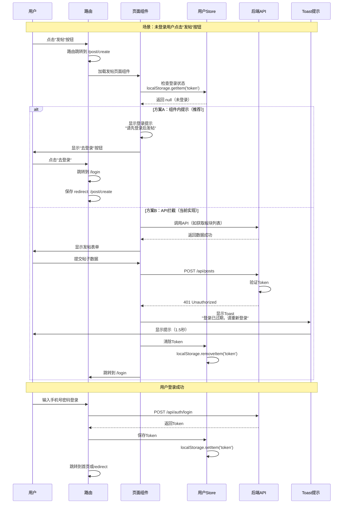

### 场景 2：未登录用户尝试执行需要登录的操作

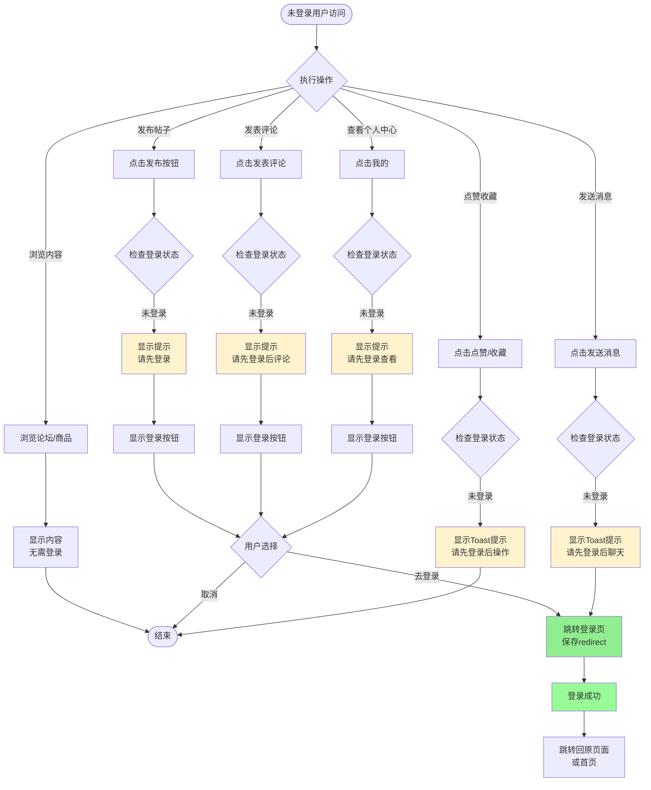

### 场景 3：Token 过期时的拦截流程

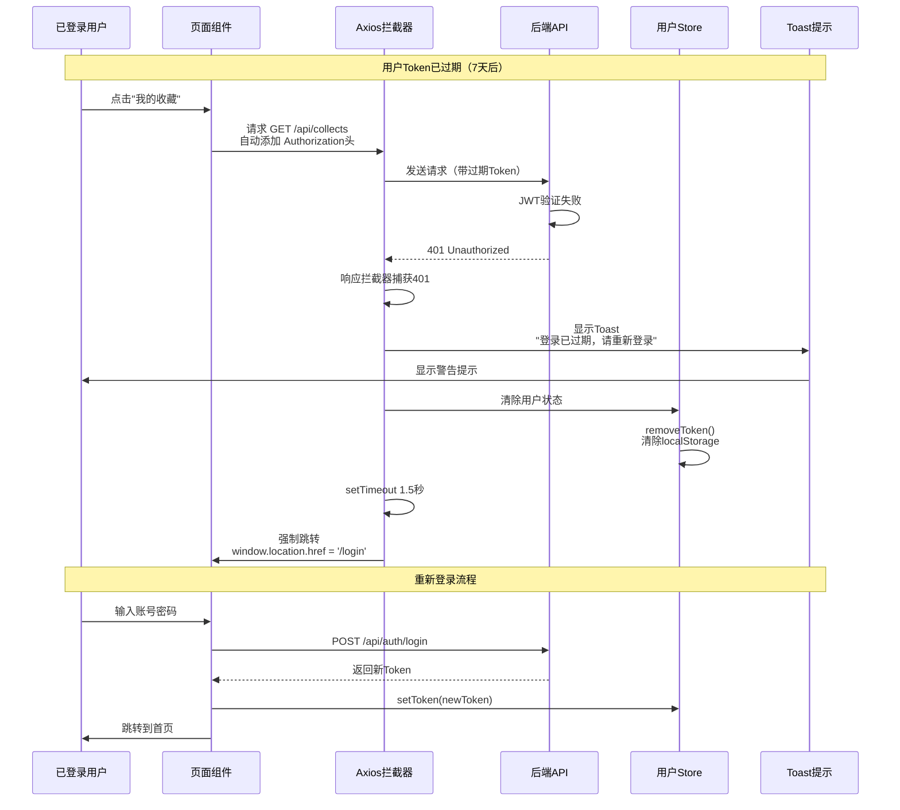

### 提示信息规范

**Toast 提示类型和内容：**

| 场景 | 提示类型 | 提示内容 | 自动跳转 |
|------|---------|---------|---------|
| Token过期 | warning | 登录已过期，请重新登录 | 1.5秒后跳转登录页 |
| 未登录操作 | warning | 请先登录后操作 | 不跳转 |
| 权限不足 | error | 没有权限执行此操作 | 不跳转 |
| 登录成功 | success | 登录成功 | 跳转首页或原页面 |
| 登出成功 | success | 已安全退出 | 跳转登录页 |

**弹窗提示场景：**
- 用户点击"发帖"、"发布商品"等主要功能按钮
- 显示确认对话框："请先登录后再发布内容"
- 提供"去登录"和"取消"两个选项

---

## 前后端权限控制协作

### 权限控制架构图

```mermaid
graph TB
    subgraph "前端权限控制"
        A1[路由配置<br/>router/index.ts]
        A2[组件内检查<br/>localStorage.getItem]
        A3[请求拦截器<br/>自动添加Token]
        A4[响应拦截器<br/>处理401/403]
    end

    subgraph "后端权限控制"
        B1[JWT Filter<br/>验证Token]
        B2[Spring Security<br/>权限校验]
        B3[Controller层<br/>@RequestHeader]
        B4[Service层<br/>业务权限检查]
    end

    subgraph "数据库层"
        C1[数据查询<br/>MyBatis-Plus]
        C2[软删除过滤<br/>@TableLogic]
    end

    A1 --> A2
    A2 --> A3
    A3 --> B1
    B1 --> B2
    B2 --> B3
    B3 --> B4
    B4 --> C1
    C1 --> C2

    A4 -->|401错误| A2
    A4 -->|清除Token| A2
    A4 -->|跳转登录| A1

    B2 -->|认证失败| A4
    B2 -->|权限不足| A4

    style A1 fill:#42b883
    style A2 fill:#42b883
    style A3 fill:#42b883
    style A4 fill:#42b883
    style B1 fill:#6db33f
    style B2 fill:#6db33f
    style B3 fill:#6db33f
    style B4 fill:#6db33f
```

### 完整权限检查流程

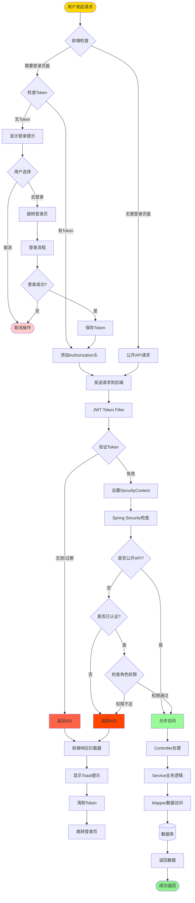

### SecurityConfig 配置详解

```mermaid
graph TB
    subgraph "SecurityConfig 权限配置"
        A[Security配置] --> B[公开端点配置]
        A --> C[认证端点配置]
        A --> D[管理员端点配置]

        B --> B1["/api/auth/**<br/>认证相关"]
        B --> B2["/api/boards/**<br/>板块列表"]
        B --> B3["/api/posts<br/>GET /api/posts/:id"]
        B --> B4["/api/comments<br/>GET请求"]
        B --> B5["/api/items<br/>GET /api/items/:id"]
        B --> B6["/swagger-ui/**<br/>API文档"]

        C --> C1["POST /api/posts<br/>创建帖子"]
        C --> C2["PUT /api/posts/:id<br/>更新帖子"]
        C --> C3["DELETE /api/posts/:id<br/>删除帖子"]
        C --> C4["POST /api/comments<br/>发表评论"]
        C --> C5["POST /api/likes/**<br/>点赞操作"]
        C --> C6["POST /api/collects/**<br/>收藏操作"]
        C --> C7["POST /api/items<br/>发布商品"]
        C --> C8["/api/conversations/**<br/>聊天功能"]
        C --> C9["/api/user/**<br/>用户信息"]
        C --> C10["/api/notifications/**<br/>通知功能"]

        D --> D1["/api/admin/**<br/>需ROLE_ADMIN"]

        B1 --> E[permitAll<br/>无需认证]
        B2 --> E
        B3 --> E
        B4 --> E
        B5 --> E
        B6 --> E

        C1 --> F[authenticated<br/>需要登录]
        C2 --> F
        C3 --> F
        C4 --> F
        C5 --> F
        C6 --> F
        C7 --> F
        C8 --> F
        C9 --> F
        C10 --> F

        D1 --> G[hasRole('ADMIN')<br/>需要管理员角色]
    end

    style E fill:#90ee90
    style F fill:#ffd700
    style G fill:#ff6347
```

### 前端改进建议

**当前实现的问题：**
1. ❌ 没有全局路由守卫，无法在路由层面拦截
2. ❌ 依赖后端返回401，用户体验不佳
3. ❌ 每个组件需要单独判断登录状态
4. ❌ 缺少统一的权限管理机制

**推荐改进方案：**

```javascript
// 1. 添加路由元信息
{
  path: '/post/create',
  meta: { requiresAuth: true },
  component: () => import('@/views/post/Create.vue')
}

// 2. 添加全局路由守卫
router.beforeEach((to, from, next) => {
  const token = localStorage.getItem('token')
  const requiresAuth = to.meta.requiresAuth

  if (requiresAuth && !token) {
    // 未登录访问受保护页面
    next({
      path: '/login',
      query: { redirect: to.fullPath }
    })
  } else {
    next()
  }
})

// 3. 统一权限检查函数
function checkAuth() {
  const token = localStorage.getItem('token')
  if (!token) {
    showToast('请先登录后操作', 'warning')
    return false
  }
  return true
}

// 4. 组件中使用
function handleClick() {
  if (!checkAuth()) {
    router.push('/login')
    return
  }
  // 执行操作
}
```

---

## 系统架构图

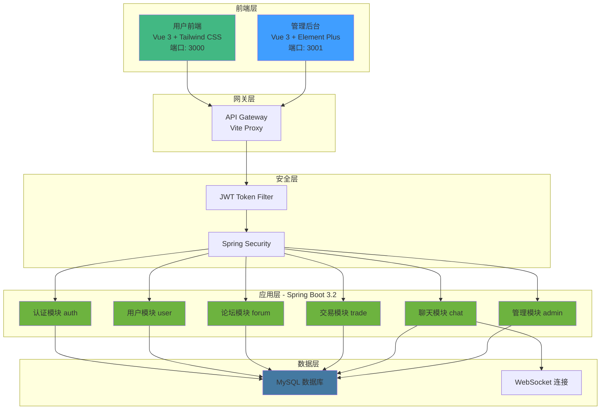

---

## 模块依赖关系图

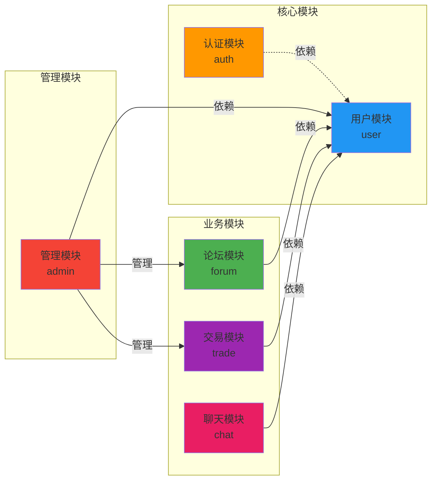

---

## 数据库ER图

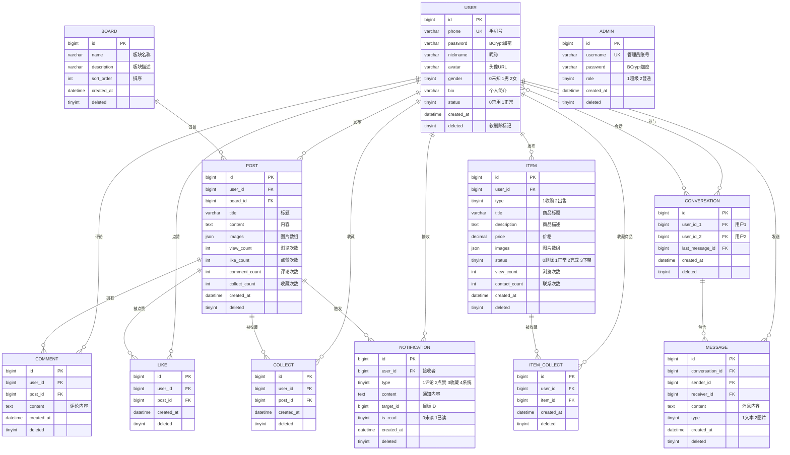

---

## 核心业务流程图

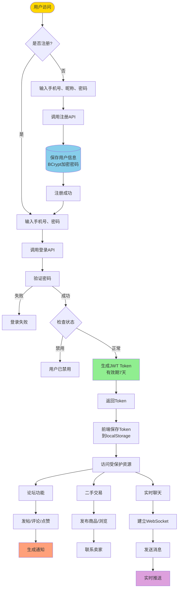

---

## 认证流程图

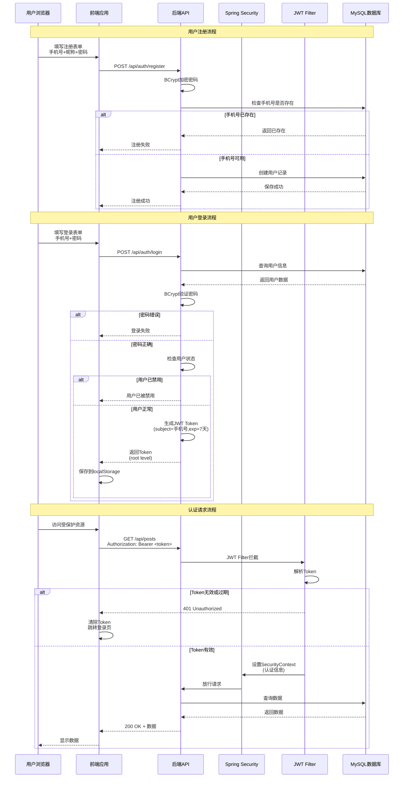

---

## 论坛模块流程

```mermaid
graph TB
    subgraph "发帖流程"
        A1[用户选择板块] --> A2[填写标题和内容]
        A2 --> A3[上传图片可选]
        A3 --> A4[提交发布]
        A4 --> A5[创建Post记录<br/>计数器初始化为0]
        A5 --> A6[返回帖子详情]
    end

    subgraph "点赞流程"
        B1[用户点击点赞] --> B2{是否已点赞?}
        B2 -->|是| B3[取消点赞<br/>Like逻辑删除]
        B2 -->|否| B4[添加点赞<br/>创建Like记录]
        B3 --> B5[帖子点赞数-1]
        B4 --> B6[帖子点赞数+1]
        B5 --> B7[更新Post.like_count]
        B6 --> B7
        B7 --> B8[创建通知<br/>type=2点赞]
    end

    subgraph "评论流程"
        C1[用户输入评论] --> C2[提交评论]
        C2 --> C3[创建Comment记录]
        C3 --> C4[帖子评论数+1]
        C4 --> C5[更新Post.comment_count]
        C5 --> C6[创建通知<br/>type=1评论]
    end

    subgraph "收藏流程"
        D1[用户点击收藏] --> D2{是否已收藏?}
        D2 -->|是| D3[取消收藏<br/>Collect逻辑删除]
        D2 -->|否| D4[添加收藏<br/>创建Collect记录]
        D3 --> D5[帖子收藏数-1]
        D4 --> D6[帖子收藏数+1]
        D5 --> D7[更新Post.collect_count]
        D6 --> D7
        D7 --> D8[创建通知<br/>type=3收藏]
    end

    subgraph "浏览流程"
        E1[用户打开帖子] --> E2[帖子浏览数+1]
        E2 --> E3[更新Post.view_count]
    end

    subgraph "通知流程"
        F1[触发通知事件] --> F2[创建Notification记录<br/>userId=帖子作者]
        F2 --> F3[用户查看通知列表]
        F3 --> F4[标记为已读<br/>Notification.is_read=1]
    end

    style A5 fill:#90ee90
    style B3 fill:#ffcccb
    style B4 fill:#90ee90
    style C3 fill:#90ee90
    style D3 fill:#ffcccb
    style D4 fill:#90ee90
    style F4 fill:#87ceeb
```

---

## 二手交易流程

```mermaid
graph TB
    subgraph "商品发布流程"
        A1[用户选择类型<br/>1收购 2出售] --> A2[填写商品信息]
        A2 --> A3[上传商品图片]
        A3 --> A4[设置价格]
        A4 --> A5[提交发布]
        A5 --> A6[创建Item记录<br/>status=1正常]
    end

    subgraph "商品浏览流程"
        B1[用户浏览商品列表] --> B2[点击商品详情]
        B2 --> B3[商品浏览数+1]
        B3 --> B4[更新Item.view_count]
        B4 --> B5[显示商品详情]
    end

    subgraph "联系卖家流程"
        C1[用户点击联系] --> C2[商品联系数+1]
        C2 --> C3[更新Item.contact_count]
        C3 --> C4[跳转聊天页面<br/>创建会话]
    end

    subgraph "商品收藏流程"
        D1[用户点击收藏] --> D2{是否已收藏?}
        D2 -->|是| D3[取消收藏<br/>ItemCollect逻辑删除]
        D2 -->|否| D4[添加收藏<br/>创建ItemCollect记录]
    end

    subgraph "商品状态管理"
        E1[卖家操作商品] --> E2{选择操作}
        E2 -->|交易完成| E3[更新status=2已完成]
        E2 -->|主动下架| E4[更新status=3已下架]
        E2 -->|删除商品| E5[逻辑删除<br/>deleted=1]
    end

    subgraph "管理员审核"
        F1[管理员审核商品] --> F2{审核结果}
        F2 -->|违规内容| F3[删除商品<br/>逻辑删除]
        F2 -->|通过审核| F4[保持status=1正常]
    end

    style A6 fill:#90ee90
    style B4 fill:#87ceeb
    style C3 fill:#ffd700
    style D3 fill:#ffcccb
    style D4 fill:#90ee90
    style E3 fill:#98fb98
    style E4 fill:#ffa07a
    style E5 fill:#ff6347
    style F3 fill:#ff4500
```

---

## 实时聊天流程

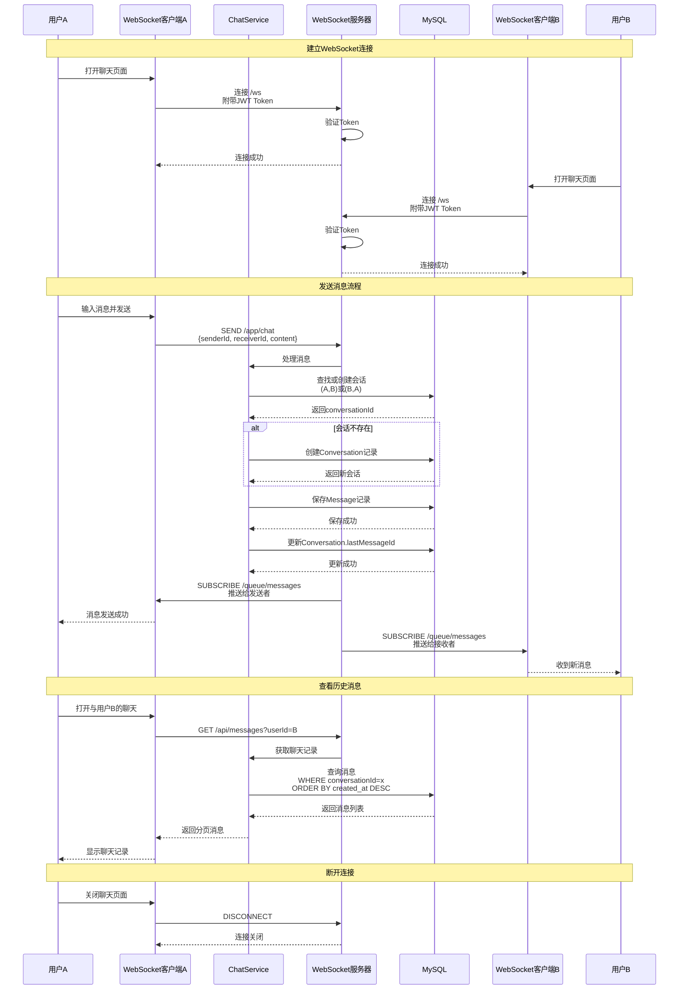

---

## 管理后台流程

```mermaid
graph TB
    subgraph "管理员登录"
        A1[管理员输入<br/>用户名+密码] --> A2[POST /api/admin/login]
        A2 --> A3[验证管理员信息]
        A3 --> A4{验证结果}
        A4 -->|失败| A5[登录失败]
        A4 -->|成功| A6[生成JWT Token<br/>包含role字段]
        A6 --> A7[返回Token]
    end

    subgraph "用户管理"
        B1[查看用户列表] --> B2[分页查询+搜索+状态筛选]
        B2 --> B3[显示用户信息]

        B4[管理用户] --> B5{管理操作}
        B5 -->|查看详情| B6[GET /users/:id<br/>隐藏密码字段]
        B5 -->|封禁用户| B7[PUT /users/:id/status<br/>status=0]
        B5 -->|解封用户| B8[PUT /users/:id/status<br/>status=1]
        B5 -->|删除用户| B9[DELETE /users/:id<br/>逻辑删除]

        B7 --> B10[用户无法登录]
        B8 --> B11[用户恢复正常]
        B9 --> B12[用户数据标记删除]
    end

    subgraph "内容审核"
        C1[查看帖子列表] --> C2[分页查询+筛选]
        C2 --> C3{审核操作}
        C3 -->|删除违规帖| C4[DELETE /admin/posts/:id]
        C3 -->|保留帖子| C5[不做操作]

        C4 --> C6[帖子逻辑删除]

        C7[查看商品列表] --> C8[分页查询+筛选]
        C8 --> C9{审核操作}
        C9 -->|删除违规商品| C10[DELETE /admin/items/:id]
        C9 -->|保留商品| C11[不做操作]

        C10 --> C12[商品逻辑删除]
    end

    subgraph "板块管理"
        D1[查看板块列表] --> D2{管理操作}
        D2 -->|创建板块| D3[POST /admin/boards<br/>name+description+sort]
        D2 -->|更新板块| D4[PUT /admin/boards/:id<br/>更新信息]
        D2 -->|删除板块| D5[DELETE /admin/boards/:id]

        D3 --> D6[创建Board记录]
        D4 --> D7[更新Board信息]
        D5 --> D8[板块逻辑删除]
    end

    subgraph "数据统计"
        E1[访问Dashboard] --> E2[用户统计]
        E2 --> E3[总用户数/正常数/禁用数]

        E4[内容统计] --> E5[帖子数/商品数/评论数]

        E6[活跃度统计] --> E7[今日发帖/今日注册/在线人数]
    end

    subgraph "权限验证"
        F1[管理员操作] --> F2{检查角色}
        F2 -->|超级管理员| F3[允许所有操作]
        F2 -->|普通管理员| F4[允许基础操作]
        F4 --> F5{特殊操作?}
        F5 -->|是| F6[权限不足]
        F5 -->|否| F7[允许操作]
    end

    style A6 fill:#90ee90
    style B7 fill:#ffcccb
    style B8 fill:#90ee90
    style B9 fill:#ff6347
    style C4 fill:#ff4500
    style C10 fill:#ff4500
    style D3 fill:#90ee90
    style D5 fill:#ff6347
    style F6 fill:#ff4500
```

---

## 附录：技术栈说明

### 后端技术栈
- **框架**: Spring Boot 3.2
- **语言**: Java 21
- **数据库**: MySQL 8.0
- **ORM**: MyBatis-Plus 3.5.5
- **安全**: Spring Security + JWT
- **实时通信**: WebSocket (STOMP协议)
- **文档**: Swagger/OpenAPI 3.0
- **密码加密**: BCrypt

### 前端技术栈

#### 用户前端 (frontend-user)
- **框架**: Vue 3
- **UI**: Tailwind CSS (自定义组件)
- **状态管理**: Pinia
- **路由**: Vue Router 4
- **HTTP**: Axios
- **构建**: Vite

#### 管理后台 (frontend-admin)
- **框架**: Vue 3
- **UI**: Element Plus
- **状态管理**: Pinia
- **路由**: Vue Router 4
- **HTTP**: Axios
- **构建**: Vite

### 关键设计模式
1. **分层架构**: Controller → Service → Mapper
2. **统一响应**: Result<T> 包装所有API响应
3. **软删除**: 所有表使用 deleted 字段标记删除
4. **字段填充**: 自动填充 created_at 和 deleted
5. **DTO模式**: 使用Request/Response DTO隔离层
6. **策略模式**: 点赞/收藏的toggle操作

---

## 附录：管理后台权限控制

### 管理后台页面权限表

| 页面路径 | 页面名称 | 普通管理员 | 超级管理员 | 说明 |
|---------|---------|-----------|-----------|------|
| `/admin/login` | 管理员登录 | ✅ | ✅ | 公开页面 |
| `/` | Dashboard仪表盘 | ✅ | ✅ | 数据统计 |
| `/users` | 用户管理 | ✅ | ✅ | 查看列表、详情 |
| `/users/:id/edit` | 编辑用户 | ❌ | ✅ | 封禁/解封/删除 |
| `/boards` | 板块管理 | ✅ | ✅ | 查看列表 |
| `/boards/create` | 创建板块 | ❌ | ✅ | 超管专属 |
| `/boards/:id/edit` | 编辑板块 | ❌ | ✅ | 超管专属 |
| `/posts` | 帖子管理 | ✅ | ✅ | 查看列表、删除 |
| `/posts/:id` | 帖子详情 | ✅ | ✅ | 查看详情 |
| `/items` | 商品管理 | ✅ | ✅ | 查看列表、删除 |
| `/items/:id` | 商品详情 | ✅ | ✅ | 查看详情 |

### 管理后台API权限表

| API 端点 | HTTP 方法 | 普通管理员 | 超级管理员 | 说明 |
|---------|----------|-----------|-----------|------|
| `/api/admin/login` | POST | ✅ | ✅ | 管理员登录 |
| `/api/admin/users` | GET | ✅ | ✅ | 获取用户列表 |
| `/api/admin/users/:id` | GET | ✅ | ✅ | 获取用户详情 |
| `/api/admin/users/:id/status` | PUT | ❌ | ✅ | 更新用户状态 |
| `/api/admin/users/:id/ban` | PUT | ❌ | ✅ | 封禁用户 |
| `/api/admin/users/:id/unban` | PUT | ❌ | ✅ | 解封用户 |
| `/api/admin/users/:id` | DELETE | ❌ | ✅ | 删除用户 |
| `/api/admin/users/stats` | GET | ✅ | ✅ | 用户统计 |
| `/api/admin/boards` | GET | ✅ | ✅ | 获取板块列表 |
| `/api/admin/boards` | POST | ❌ | ✅ | 创建板块 |
| `/api/admin/boards/:id` | PUT | ❌ | ✅ | 更新板块 |
| `/api/admin/boards/:id` | DELETE | ❌ | ✅ | 删除板块 |
| `/api/admin/posts` | GET | ✅ | ✅ | 获取帖子列表 |
| `/api/admin/posts/:id` | DELETE | ✅ | ✅ | 删除帖子 |
| `/api/admin/items` | GET | ✅ | ✅ | 获取商品列表 |
| `/api/admin/items/:id` | DELETE | ✅ | ✅ | 删除商品 |

### 管理员权限验证流程

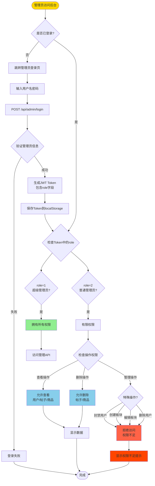

### 管理员角色权限对比

**超级管理员（role=1）：**
- ✅ 查看所有数据（用户、帖子、商品、板块）
- ✅ 创建、编辑、删除板块
- ✅ 封禁、解封、删除用户
- ✅ 删除帖子、商品
- ✅ 查看统计数据

**普通管理员（role=2）：**
- ✅ 查看所有数据（用户、帖子、商品、板块）
- ✅ 删除帖子、商品
- ✅ 查看统计数据
- ❌ 创建、编辑、删除板块
- ❌ 封禁、解封、删除用户

---

## 变更记录

| 日期 | 版本 | 变更内容 |
|------|------|---------|
| 2025-01-27 | v1.1 | 新增未登录业务逻辑和权限控制流程 |
| 2025-01-27 | v1.0 | 初始版本，完整业务逻辑文档 |

---

**文档生成时间**: 2025-01-27
**项目版本**: backend-1.0.0
**作者**: Claude Code
