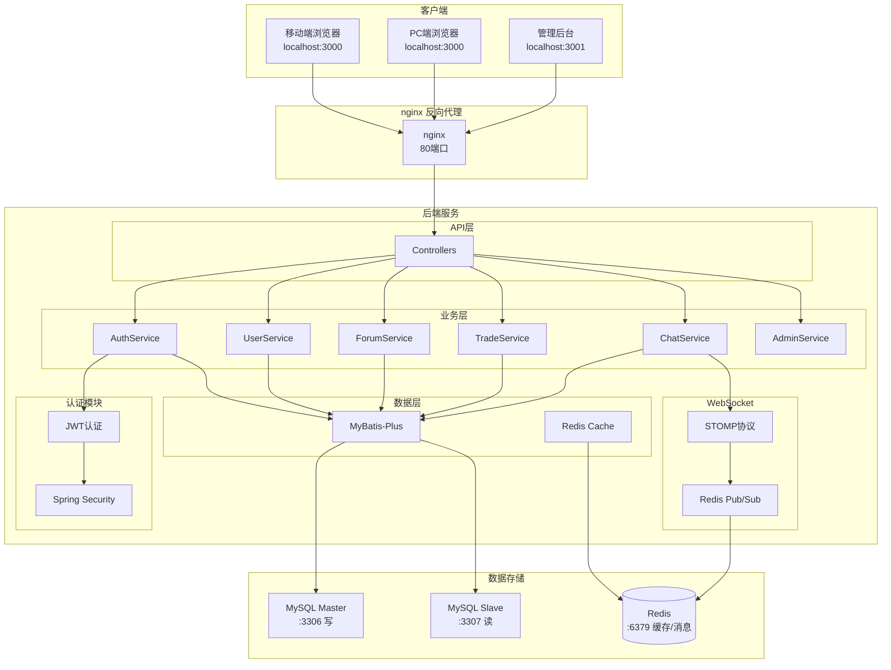
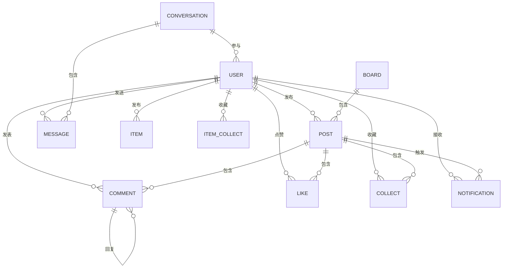
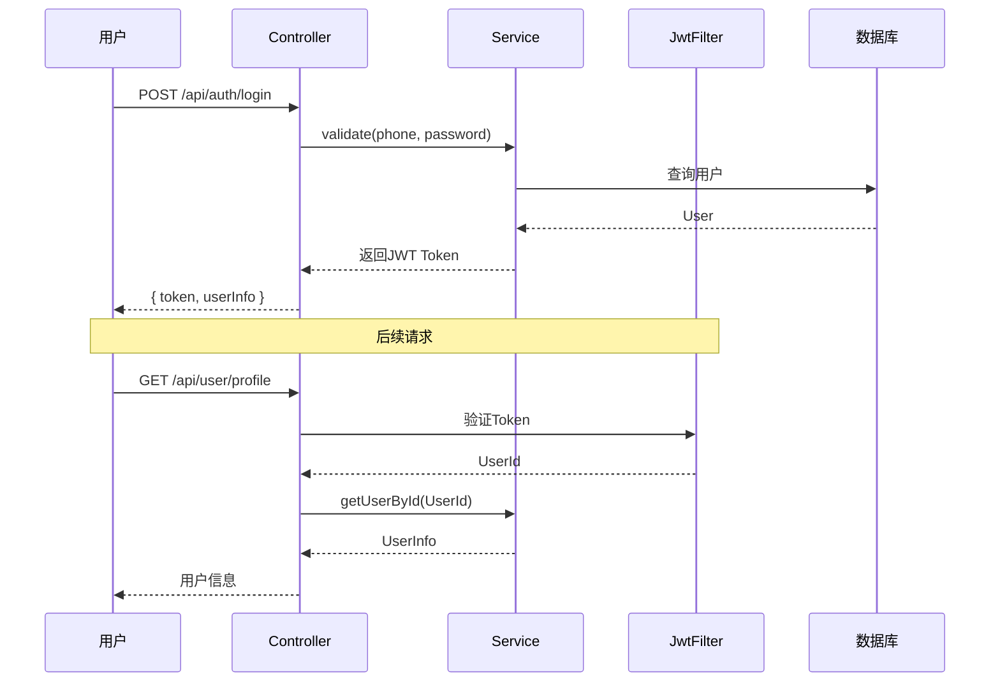

# 校园互助平台 - 系统架构设计

## 概述

校园互助平台是一个面向大学生的综合性校园服务应用，提供论坛交流、闲置交易、即时通讯等功能。系统采用前后端分离架构，支持移动端和PC端访问。

## 技术栈

| 层级 | 技术 |
|------|------|
| 后端框架 | Spring Boot 3.2 + Java 17 |
| ORM | MyBatis-Plus 3.5 |
| 数据库 | MySQL 8.0 (读写分离) |
| 缓存 | Redis 7 |
| WebSocket | STOMP over SockJS |
| 用户前端 | Vue 3 + Vant UI + Tailwind CSS v4 |
| 管理后台 | Vue 3 + Element Plus |
| 构建工具 | Vite 5 |
| 反向代理 | nginx |

## 系统架构图



## 后端架构

### 包结构

```
com.campus/
├── CampusApplication.java          # 启动类
├── common/                         # 公共组件
│   ├── Result.java                 # 统一响应封装
│   ├── ResultCode.java             # 响应码枚举
│   └── GlobalExceptionHandler.java # 全局异常处理
├── config/                         # 配置类
│   ├── JwtConfig.java              # JWT配置
│   ├── JwtAuthenticationFilter.java # JWT过滤器
│   ├── SecurityConfig.java         # Spring Security配置
│   ├── WebSocketConfig.java        # WebSocket配置
│   ├── DynamicDataSourceConfig.java # 数据源配置
│   ├── DsAspectConfig.java         # 读写分离AOP配置
│   ├── ReadWriteRouteAspect.java   # 读写分离切面
│   └── SwaggerConfig.java          # Swagger配置
├── entity/                         # 实体基类
│   └── BaseEntity.java             # 公共字段(id, createTime, updateTime)
├── mapper/                         # 通用Mapper
│   └── BaseDaoMapper.java          # 通用DAO接口
└── modules/                        # 业务模块
    ├── auth/                       # 认证模块
    │   ├── controller/AuthController.java
    │   ├── service/AuthService.java
    │   ├── dto/LoginRequest.java
    │   └── dto/RegisterRequest.java
    ├── user/                       # 用户模块
    │   ├── controller/UserController.java
    │   ├── controller/UserPublicController.java
    │   ├── service/UserService.java
    │   ├── mapper/UserMapper.java
    │   ├── entity/User.java
    │   └── dto/UpdateProfileRequest.java
    ├── forum/                      # 论坛模块
    │   ├── controller/
    │   │   ├── PostController.java
    │   │   ├── CommentController.java
    │   │   ├── LikeController.java
    │   │   ├── CollectController.java
    │   │   ├── BoardController.java
    │   │   └── NotificationController.java
    │   ├── service/
    │   │   ├── PostService.java
    │   │   ├── CommentService.java
    │   │   ├── LikeService.java
    │   │   ├── CollectService.java
    │   │   ├── BoardService.java
    │   │   └── NotificationService.java
    │   ├── mapper/
    │   │   ├── PostMapper.java
    │   │   ├── CommentMapper.java
    │   │   ├── LikeMapper.java
    │   │   ├── CollectMapper.java
    │   │   ├── BoardMapper.java
    │   │   └── NotificationMapper.java
    │   ├── entity/
    │   │   ├── Post.java
    │   │   ├── Comment.java
    │   │   ├── Like.java
    │   │   ├── Collect.java
    │   │   ├── Board.java
    │   │   └── Notification.java
    │   └── dto/
    ├── trade/                       # 闲置交易模块
    │   ├── controller/ItemController.java
    │   ├── service/ItemService.java
    │   ├── mapper/ItemMapper.java
    │   └── entity/Item.java
    ├── chat/                        # 即时通讯模块
    │   ├── controller/ChatController.java
    │   ├── service/ChatService.java
    │   ├── websocket/
    │   │   ├── WebSocketConfig.java
    │   │   └── WebSocketAuthInterceptor.java
    │   ├── entity/Message.java
    │   └── entity/Conversation.java
    ├── admin/                       # 管理后台模块
    │   ├── controller/
    │   │   ├── AdminAuthController.java
    │   │   ├── DashboardController.java
    │   │   ├── UserManagementController.java
    │   │   ├── PostManagementController.java
    │   │   ├── BoardManagementController.java
    │   │   └── ItemManagementController.java
    │   └── service/
    └── common/                      # 通用功能
        └── controller/UploadController.java
```

### 分层架构

```mermaid
flowchart LR
    subgraph Controller ["Controller 层"]
        Direction TB
        REST[REST API]
        Validate[参数校验]
    end

    subgraph Service ["Service 层"]
        Direction TB
        Business[业务逻辑]
        TX[事务管理]
    end

    subgraph Mapper ["Mapper 层"]
        Direction TB
        SQL[SQL执行]
        Cache[缓存处理]
    end

    REST --> Validate
    Validate --> Business
    Business --> TX
    TX --> SQL
    SQL --> Cache
```

### 设计原则

1. **Controller层**：处理HTTP请求、参数校验、返回统一响应
2. **Service层**：业务逻辑处理、事务管理
3. **Mapper层**：数据库操作、缓存处理
4. **Entity层**：数据模型定义

## 前端架构

### 用户端 (frontend-user)

```
src/
├── api/                    # API接口
│   ├── auth.js             # 认证相关
│   ├── user.js             # 用户相关
│   ├── posts.js            # 帖子相关
│   ├── items.js            # 闲置相关
│   ├── chat.js             # 聊天相关
│   └── notifications.js   # 通知相关
├── components/             # 公共组件
├── views/                  # 页面视图
│   ├── forum/              # 论坛页面
│   ├── trade/              # 闲置市场
│   ├── messages/           # 消息中心
│   └── profile/            # 个人中心
├── layouts/                # 布局组件
│   ├── MainLayout.vue      # 主布局(移动端TabBar)
│   └── PCLayout.vue        # PC端布局(侧边栏)
├── router/                 # 路由配置
├── stores/                 # Pinia状态管理
│   ├── user.js             # 用户状态
│   └── chat.js             # 聊天状态
├── styles/                 # 样式文件
│   ├── design-tokens.css   # 设计令牌
│   └── main.css            # 全局样式
└── utils/                  # 工具函数
```

### 管理后台 (frontend-admin)

```
src/
├── api/                    # API接口
├── views/                  # 页面视图
│   ├── login/              # 登录页
│   ├── dashboard/          # 仪表盘
│   ├── users/              # 用户管理
│   ├── boards/             # 板块管理
│   ├── posts/              # 帖子管理
│   └── items/              # 物品管理
├── router/                 # 路由配置
└── stores/                 # 状态管理
```

### 响应式设计

| 断点 | 宽度 | 布局 |
|------|------|------|
| Mobile | ≤640px | 底部TabBar导航，全屏宽度 |
| Tablet | 768-1023px | 底部TabBar导航，内容居中(最大480px) |
| Desktop | ≥1024px | 左侧边栏导航，内容居中(最大640px) |

## 数据库架构

### 核心表结构



### 读写分离

| 操作类型 | 数据源 | 说明 |
|----------|--------|------|
| INSERT | master | 主库写入 |
| UPDATE | master | 主库更新 |
| DELETE | master | 主库删除 |
| SELECT | slave | 从库读取 |

**实现方式**：
- `@DS("master")` 注解：写操作
- `@DS("slave")` 注解：读操作
- `DsAspectConfig`：AOP自动切换

## 安全架构

### 认证流程



### JWT配置

| 配置项 | 值 |
|--------|-----|
| 签名算法 | HS256 |
| 密钥长度 | 256位+ |
| 过期时间 | 7天 (604800000ms) |
| 请求头 | Authorization |
| 前缀 | Bearer |

### 接口安全

1. **认证接口**：公开访问
2. **业务接口**：需携带有效JWT Token
3. **管理接口**：需管理员角色权限
4. **敏感操作**：记录操作日志

## 部署架构

### 开发环境

```
┌─────────────────────────────────────────────────┐
│                  本地开发机                       │
│  ┌─────────┐  ┌─────────┐  ┌─────────┐         │
│  │ 后端    │  │ 用户前端 │  │ 管理前端 │         │
│  │ :8080   │  │ :3000   │  │ :3001   │         │
│  └────┬────┘  └────┬────┘  └────┬────┘         │
│       │            │            │               │
│       └────────────┼────────────┘               │
│                    │                            │
│              ┌─────▼─────┐                      │
│              │  Vite     │                      │
│              │  代理     │                      │
│              └─────┬─────┘                      │
└────────────────────┼────────────────────────────┘
                     │
              ┌──────▼──────┐
              │  WSL Docker │
              │  MySQL :3306│
              │  Redis :6379│
              └─────────────┘
```

### 生产环境 (Docker Swarm)

```
┌─────────────────────────────────────────────────────┐
│                   负载均衡层                         │
│                  nginx :80                          │
└─────────────────────┬───────────────────────────────┘
                      │
     ┌────────────────┼────────────────┐
     │                │                │
┌────▼────┐    ┌─────▼─────┐    ┌─────▼─────┐
│用户前端  │    │  管理前端  │    │  后端API   │
│:3000 x2 │    │ :3001 x2  │    │:8080 x2   │
└─────────┘    └───────────┘    └─────┬─────┘
                                       │
                    ┌──────────────────┼──────────────────┐
                    │                  │                  │
               ┌────▼───┐        ┌─────▼─────┐      ┌────▼───┐
               │ MySQL  │        │  Redis    │      │ 存储   │
               │ :3306  │        │  :6379    │      │uploads │
               └────────┘        └───────────┘      └────────┘
```

## 扩展性设计

### 水平扩展

1. **前端**：多实例部署，nginx负载均衡
2. **后端**：多实例部署，WebSocket支持Redis Pub/Sub集群
3. **数据库**：读写分离，主从复制

### 垂直扩展

1. **缓存**：Redis集群
2. **消息队列**：Redis Pub/Sub → Kafka/RabbitMQ
3. **分布式存储**：MinIO/OSS

### 模块化设计

1. **功能模块独立**：各业务模块通过包路径隔离
2. **配置外部化**：环境变量管理配置
3. **接口版本化**：URL路径版本控制

## 性能优化

### 后端优化

| 优化点 | 实现方式 |
|--------|----------|
| 数据库连接池 | Druid |
| SQL优化 | 索引、N+1查询优化 |
| 缓存 | Redis热点数据缓存 |
| 读写分离 | AOP自动切换数据源 |
| 异步处理 | 通知、消息推送异步化 |

### 前端优化

| 优化点 | 实现方式 |
|--------|----------|
| 按需加载 | Vue Router懒加载 |
| 静态资源 | CDN/压缩 |
| 图片 | 懒加载、压缩 |
| 状态管理 | Pinia持久化 |
| 请求 | Axios拦截器统一处理 |

## 监控与日志

### 日志级别

| 级别 | 用途 |
|------|------|
| ERROR | 错误信息 |
| WARN | 警告信息 |
| INFO | 关键业务日志 |
| DEBUG | 开发调试 |

### 日志内容

1. **访问日志**：请求路径、参数、响应时间
2. **业务日志**：关键操作记录
3. **异常日志**：错误堆栈信息
4. **安全日志**：登录、权限校验

## 相关文档

- [QUICK_START.md](./QUICK_START.md) - 快速启动
- [DEPLOYMENT_PROD.md](./DEPLOYMENT_PROD.md) - 生产部署
- [ENVIRONMENT_VARIABLES.md](./ENVIRONMENT_VARIABLES.md) - 环境变量
- [TROUBLESHOOTING.md](./TROUBLESHOOTING.md) - 故障排查
