# 校园帮平台 - 业务流程图

## 整体架构流程

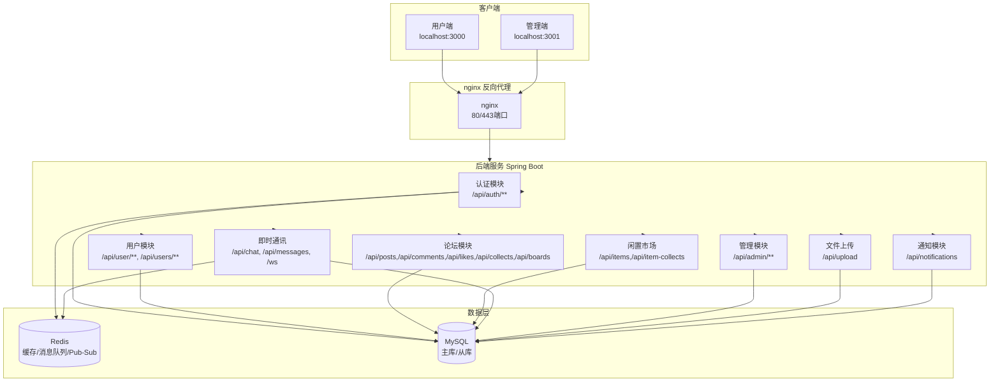

## 核心业务模块

### 1. 用户模块

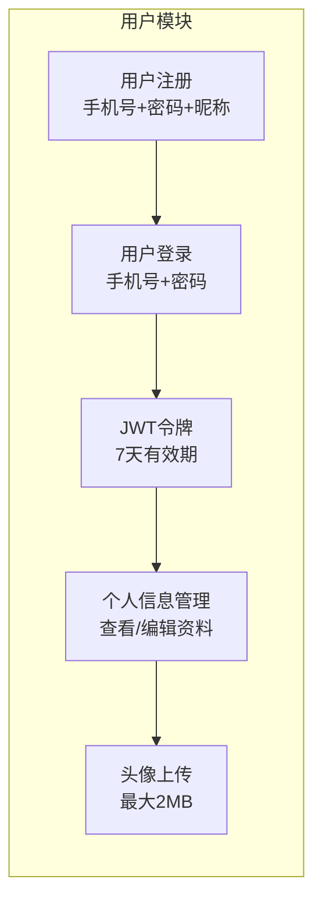

**用户端功能:**
- 注册: 手机号 + 密码 + 昵称
- 登录: 返回JWT Token
- 个人信息: 昵称、性别、简介、头像、年级、专业
- 查看他人主页: 获取用户公开信息和发布内容

### 2. 论坛模块

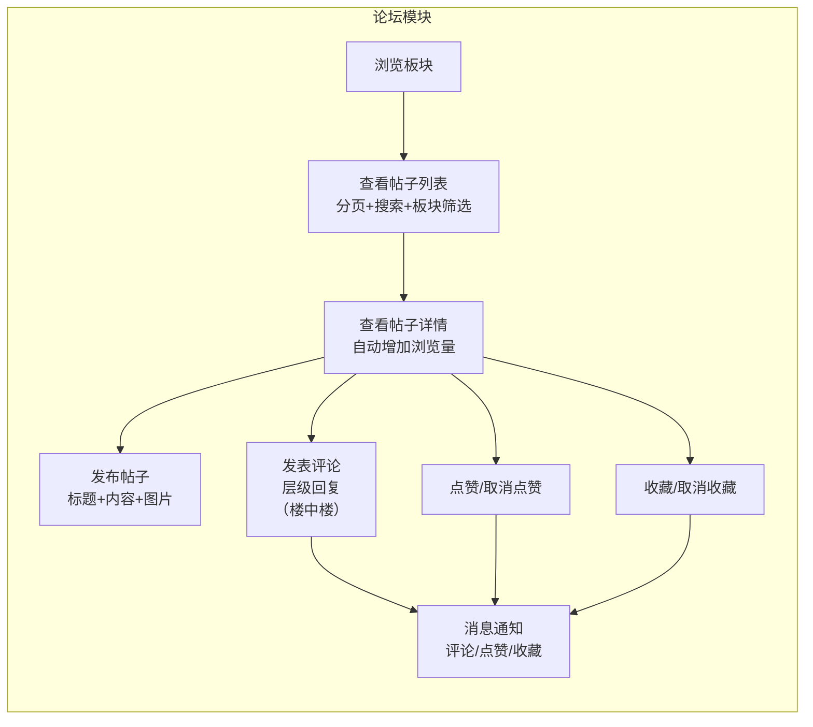

**数据结构:**
- `board`: 板块表 (id, name, description, icon, sort, status)
- `post`: 帖子表 (id, userId, boardId, title, content, images, viewCount, likeCount, commentCount, collectCount)
- `comment`: 评论表 (id, userId, postId, parentId, content) - 支持楼中楼回复
- `like`: 点赞表 (id, userId, postId) - 物理删除
- `collect`: 收藏表 (id, userId, postId) - 物理删除

### 3. 闲置市场模块

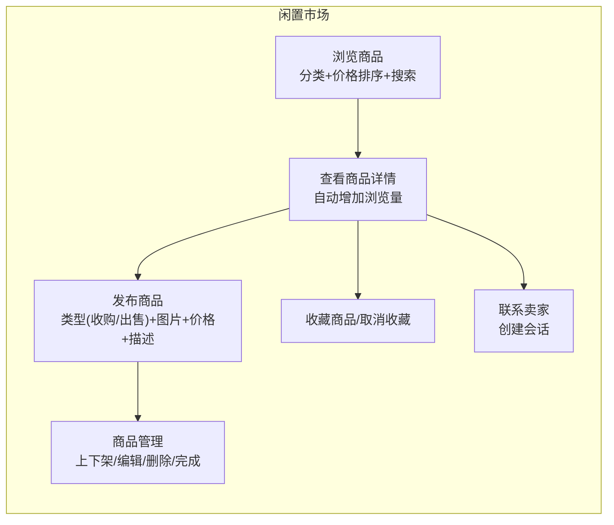

**物品类型:**
- 类型: 1=收购, 2=出售
- 状态: 0=已删除, 1=正常, 2=已完成, 3=已下架

### 4. 即时通讯模块

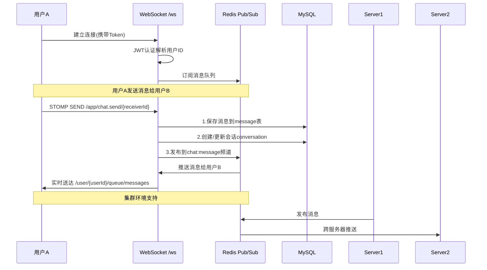

**WebSocket配置:**
- 端点: `/ws`, `/ws/` (支持SockJS)
- STOMP代理: 简单内存代理
- 广播主题: `/topic/*`
- 点对点队列: `/queue/*`
- 应用前缀: `/app`
- 用户前缀: `/user`

**Redis Pub/Sub:**
- 频道: `chat:message` - 用于集群环境消息同步
- 订阅者: `ChatMessageSubscriber` - 接收消息并推送给用户

**数据结构:**
- `conversation`: 会话表 (id, userId1, userId2, lastMessageId, unreadCount1, unreadCount2)
- `message`: 消息表 (id, conversationId, senderId, receiverId, content, type)

### 5. 通知模块

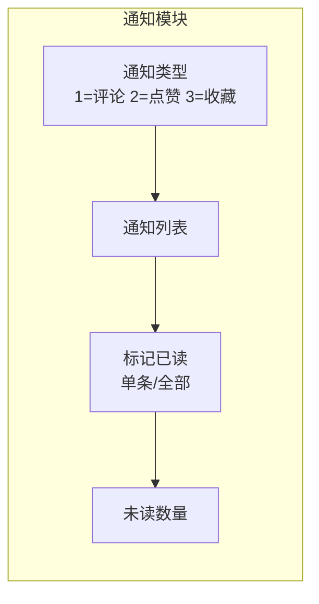

**触发场景:**
- 评论: 他人评论你的帖子
- 点赞: 他人点赞你的帖子
- 收藏: 他人收藏你的帖子

### 6. 管理后台模块

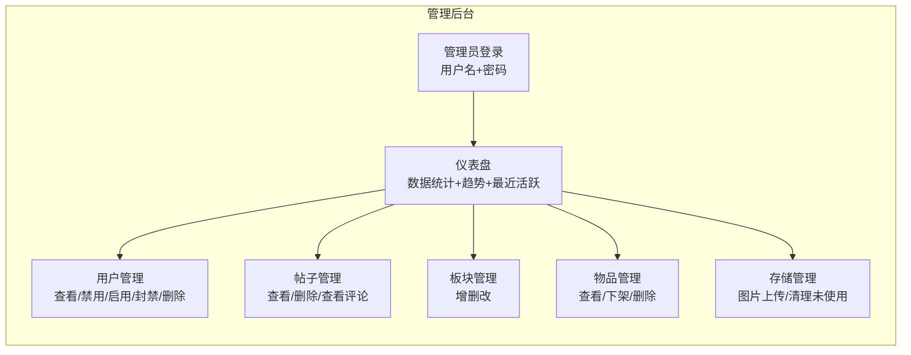

**管理员角色:**
- 超级管理员 (role=1): 全部权限
- 普通管理员 (role=2): 有限权限

## 前端页面结构

### 用户端 (localhost:3000)

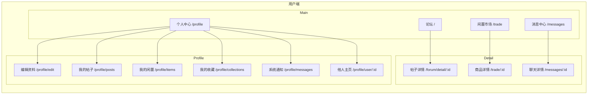

### 管理端 (localhost:3001)

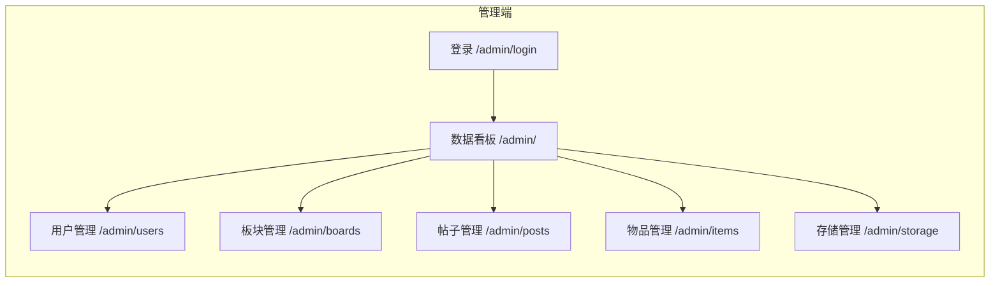

## 数据模型关系

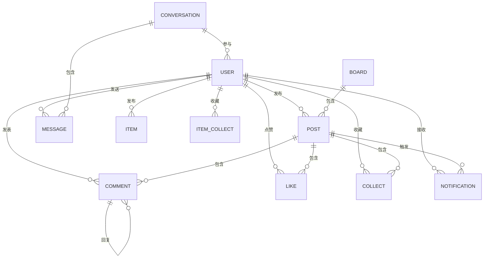

## API 路由概览

### 认证模块 `/api/auth/**`
| 方法 | 路径 | 说明 |
|------|------|------|
| POST | /api/auth/register | 用户注册 |
| POST | /api/auth/login | 用户登录 |
| POST | /api/auth/logout | 用户登出 |

### 用户模块 `/api/user/**`, `/api/users/**`
| 方法 | 路径 | 说明 |
|------|------|------|
| GET | /api/user/profile | 获取当前用户信息 |
| PUT | /api/user/profile | 更新用户信息 |
| GET | /api/user/public/{userId} | 获取用户公开信息 |
| POST | /api/user/avatar | 上传头像 |
| GET | /api/users/{id} | 获取用户公开档案 |
| GET | /api/users/{id}/posts | 获取用户帖子 |
| GET | /api/users/{id}/items | 获取用户物品 |

### 论坛模块
| 方法 | 路径 | 说明 |
|------|------|------|
| GET | /api/posts | 帖子列表 |
| GET | /api/posts/{id} | 帖子详情 |
| POST | /api/posts | 发布帖子 |
| PUT | /api/posts/{id} | 更新帖子 |
| DELETE | /api/posts/{id} | 删除帖子 |
| GET | /api/posts/search | 搜索帖子 |
| POST | /api/posts/{postId}/like | 点赞/取消 |
| POST | /api/posts/{postId}/collect | 收藏/取消 |
| GET | /api/posts/collections | 收藏列表 |
| GET | /api/comments/post/{postId} | 评论列表 |
| POST | /api/comments |发表评论 |
| DELETE | /api/comments/{id} | 删除评论 |
| GET | /api/boards | 板块列表 |

### 闲置市场模块 `/api/items/**`
| 方法 | 路径 | 说明 |
|------|------|------|
| GET | /api/items | 物品列表 |
| GET | /api/items/{itemId} | 物品详情 |
| POST | /api/items | 发布物品 |
| PUT | /api/items/{itemId} | 更新物品 |
| DELETE | /api/items/{itemId} | 删除物品 |
| PUT | /api/items/{itemId}/online | 上架 |
| PUT | /api/items/{itemId}/offline | 下架 |
| PUT | /api/items/{itemId}/complete | 标记完成 |
| POST | /api/items/{itemId}/contact | 联系卖家 |
| POST | /api/items/{itemId}/collect | 收藏/取消 |
| GET | /api/items/collected | 收藏列表 |

### 即时通讯模块 `/api/chat/**`, `/api/messages/**`
| 方法 | 路径 | 说明 |
|------|------|------|
| GET | /api/conversations | 会话列表 |
| GET | /api/conversations/{id}/messages | 消息历史 |
| GET | /api/messages/{userId} | 聊天记录 |
| POST | /api/messages/{userId} | 发送消息 |
| POST | /api/conversations/{id}/read | 标记已读 |
| GET | /api/conversations/unread/count | 未读数 |

**WebSocket:**
- 端点: `/ws`
- 发送: `/app/chat.send/{receiverId}`
- 接收: `/user/{userId}/queue/messages`

### 通知模块 `/api/notifications/**`
| 方法 | 路径 | 说明 |
|------|------|------|
| GET | /api/notifications | 通知列表 |
| GET | /api/notifications/unread/count | 未读数 |
| PUT | /api/notifications/{id}/read | 标记已读 |
| PUT | /api/notifications/read/all | 全部已读 |

### 管理模块 `/api/admin/**`
| 方法 | 路径 | 说明 |
|------|------|------|
| POST | /api/admin/auth/login | 管理员登录 |
| GET | /api/admin/dashboard/overview | 仪表盘数据 |
| GET | /api/admin/users | 用户列表 |
| PUT | /api/admin/users/{id}/status | 更新状态 |
| PUT | /api/admin/users/{id}/ban | 封禁用户 |
| GET | /api/admin/posts | 帖子列表 |
| DELETE | /api/admin/posts/{id} | 删除帖子 |
| GET | /api/admin/items | 物品列表 |
| GET | /api/admin/boards | 板块列表 |
| POST | /api/admin/boards | 创建板块 |

### 文件上传 `/api/upload/**`
| 方法 | 路径 | 说明 |
|------|------|------|
| POST | /api/upload/image | 单图上传 |
| POST | /api/upload/images | 多图上传 |
| DELETE | /api/upload/image | 删除图片 |
| GET | /api/upload/unused | 未使用图片 |
| DELETE | /api/upload/unused/clean | 清理未使用 |

## 读写分离架构

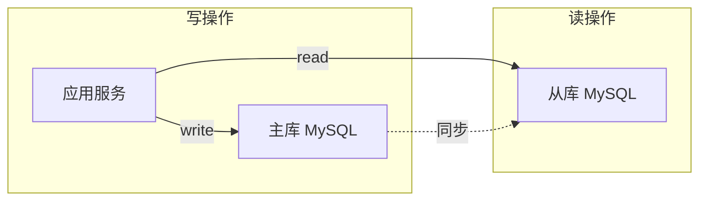

**实现方式:**
- `@DS("master")` - 写操作 (默认)
- `@DS("slave")` - 读操作
- 通过 `DsAspectConfig` 和 `ReadWriteRouteAspect` 配置

## 部署架构

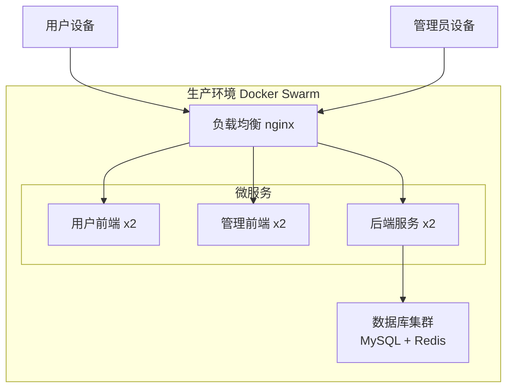

## 技术栈总结

| 层级 | 技术 |
|------|------|
| 前端用户 | Vue 3 + Vant UI + Tailwind CSS |
| 前端管理 | Vue 3 + Element Plus |
| 后端 | Spring Boot 3.2 + Java 17 |
| ORM | MyBatis-Plus |
| 数据库 | MySQL (读写分离) |
| 缓存/消息 | Redis |
| WebSocket | STOMP over WebSocket + Redis Pub/Sub |
| 反向代理 | nginx |

## 核心业务流程细节

### 1. 用户注册登录流程
```
1. 用户POST /api/auth/register (phone, password, nickname)
2. 后端验证并创建用户，返回JWT Token
3. 后续请求Header携带 Authorization: Bearer <token>
4. Token有效期7天
```

### 2. 帖子发布流程
```
1. 用户登录后访问 /forum/create
2. 上传图片到 /api/upload/images
3. POST /api/posts (title, content, images, boardId)
4. 后端保存帖子，返回帖子ID
5. 跳转到帖子详情页
```

### 3. 互动通知流程
```
1. 用户A点赞用户B的帖子
2. 后端:
   - 保存点赞记录到 like 表
   - 更新帖子 likeCount
   - 创建通知记录到 notification 表
3. 用户B收到通知 (WebSocket推送 + 通知列表)
```

### 4. 物品交易流程
```
1. 用户A发布物品 (类型: 收购/出售)
2. 用户B查看物品详情
3. 点击"联系卖家"
4. POST /api/items/{id}/contact
5. 后端创建会话 conversation
6. 双方进入聊天页面 /messages/:id
7. 通过 WebSocket 实时聊天
```

### 5. 管理员审核流程
```
1. 管理员登录 /admin/login
2. 查看仪表盘统计数据
3. 对违规内容:
   - 帖子: DELETE /api/admin/posts/{id}
   - 物品: PUT /api/admin/items/{id}/offline
   - 用户: PUT /api/admin/users/{id}/ban
```
