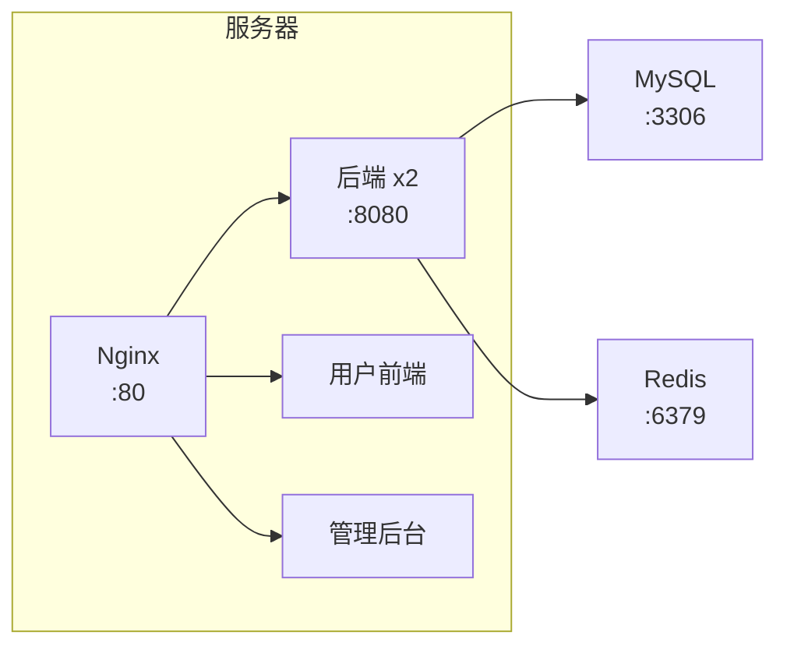

# 生产环境部署指南

## 部署架构



## 服务列表

| 容器 | 镜像 | 端口 | 说明 |
|------|------|------|------|
| campus-nginx | campus-nginx:latest | 80, 443 | Nginx 反向代理 |
| campus-backend | campus-backend:latest | 8080 | 后端 API (2副本) |
| campus-mysql | mysql:8.0 | 3306 | MySQL 数据库 |
| campus-redis | redis:7-alpine | 6379 | Redis 缓存 |
| campus-frontend-user | campus-frontend-user:latest | - | 用户前端 |
| campus-frontend-admin | campus-frontend-admin:latest | - | 管理后台 |

## 快速部署

### Docker Swarm 模式

```bash
# 初始化 Swarm (仅首次)
docker swarm init

# 构建镜像
docker build -f deploy/Dockerfile.backend -t campus-backend:latest ./backend
docker build -f deploy/Dockerfile.frontend -t campus-frontend-user:latest ./frontend-user
docker build -f deploy/Dockerfile.frontend -t campus-frontend-admin:latest ./frontend-admin
docker build -f deploy/Dockerfile.nginx -t campus-nginx:latest .

# 部署
docker stack deploy -c deploy/docker-stack.yml campus

# 查看状态
docker stack services campus

# 移除
docker stack rm campus
```

### Docker Compose 模式

```bash
# 启动
docker-compose -f deploy/docker-compose.dev.yml up -d

# 查看日志
docker-compose -f deploy/docker-compose.dev.yml logs -f

# 停止
docker-compose -f deploy/docker-compose.dev.yml down
```

## 关键配置

### Nginx 配置要点

```nginx
# /admin 必须放在 /api 之前
location /admin {
    root /usr/share/nginx/html;
    try_files $uri $uri/ /admin/index.html;
}

location /api/ {
    proxy_pass http://backend:8080;
    # ...
}
```

**注意**：
- 使用 Docker 服务名，禁止硬编码 IP
- `/admin` location 必须放在 `/api` 之前

### MySQL 字符集

```ini
[mysqld]
character-set-server=utf8mb4
collation-server=utf8mb4_unicode_ci
```

## 验证命令

```bash
# 首页
curl -s -o /dev/null -w "%{http_code}" http://192.168.100.133/

# 管理后台
curl -s -o /dev/null -w "%{http_code}" http://192.168.100.133/admin/

# API 健康检查
curl -s http://192.168.100.133/api/health

# 数据库字符集
docker exec campus-mysql mysql -uroot -p123 -e "SHOW VARIABLES LIKE 'character_set%';"
```

## 配置文件清单

| 文件 | 说明 |
|------|------|
| `deploy/docker-stack.yml` | Swarm 编排 |
| `deploy/docker-compose.dev.yml` | Compose 配置 |
| `deploy/nginx.conf` | Nginx 配置 |
| `deploy/mysql-charset.cnf` | MySQL 字符集 |
| `deploy/Dockerfile.*` | 镜像构建 |

详见 [TROUBLESHOOTING.md](./TROUBLESHOOTING.md) 排查常见问题。
