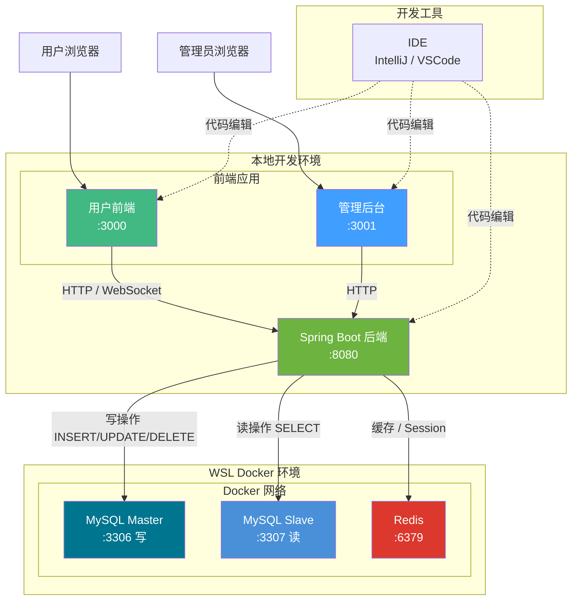

# 开发环境启动架构

## 架构图



## 数据流向说明

| 操作类型 | 目标数据库 |
|----------|------------|
| 写操作 (INSERT/UPDATE/DELETE) | Master (localhost:3306) |
| 读操作 (SELECT) | Slave (localhost:3307) |
| 缓存/Session | Redis (localhost:6379) |

## 启动命令

**后端** (Java 17 + Spring Boot):
```bash
cd backend
mvn spring-boot:run
```

**用户前端**:
```bash
cd frontend-user
npm run dev
```

**管理后台**:
```bash
cd frontend-admin
npm run dev
```

## 端口说明

| 服务 | 地址 |
|------|------|
| 用户前端 | http://localhost:3000 |
| 管理后台 | http://localhost:3001 |
| 后端 API | http://localhost:8080 |
| MySQL Master (WSL) | localhost:3306 |
| MySQL Slave (WSL) | localhost:3307 |
| Redis (WSL) | localhost:6379 |

## 技术栈

- **后端**: Spring Boot 3.2 + Java 17 + MyBatis-Plus (读写分离)
- **用户前端**: Vue 3 + Vant UI + Tailwind CSS v4
- **管理后台**: Vue 3 + Element Plus
- **数据库**: MySQL 8.0 (主从复制)
- **缓存**: Redis 7
