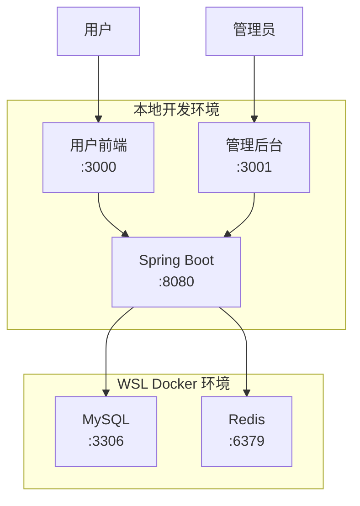
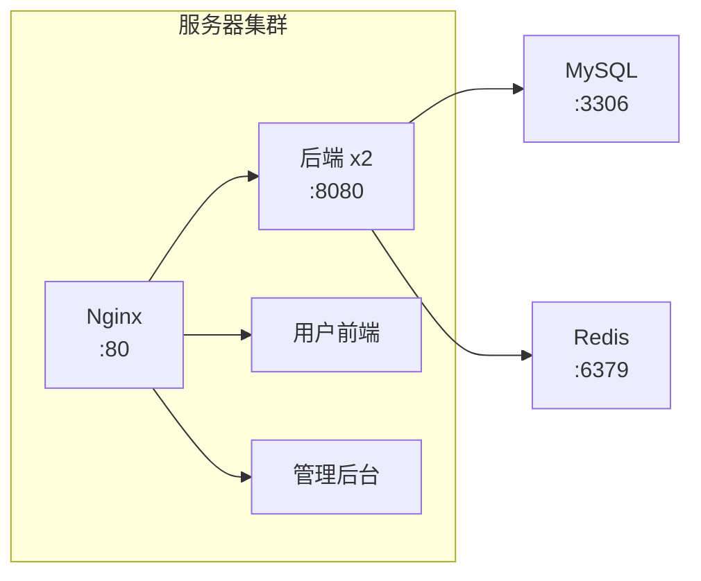

# 环境配置指南

## 概述

项目包含开发环境和生产环境两套部署方案。

## 快速导航

| 场景 | 参考文档 |
|------|----------|
| 本地开发启动 | [QUICK_START.md](./QUICK_START.md) |
| 生产环境部署 | [DEPLOYMENT_PROD.md](./DEPLOYMENT_PROD.md) |
| 问题排查 | [TROUBLESHOOTING.md](./TROUBLESHOOTING.md) |

## 开发环境架构



### 端口说明

| 服务 | 地址 |
|------|------|
| 用户前端 | http://localhost:3000 |
| 管理后台 | http://localhost:3001 |
| 后端 API | http://localhost:8080 |
| MySQL | localhost:3306 |
| Redis | localhost:6379 |

### 数据流向

| 操作类型 | 目标 |
|----------|------|
| 写操作 (INSERT/UPDATE/DELETE) | MySQL Master |
| 读操作 (SELECT) | MySQL Slave |
| 缓存/Session | Redis |

## 生产环境架构



### 服务地址

| 服务 | 地址 |
|------|------|
| 前端首页 | http://192.168.100.133 |
| 管理后台 | http://192.168.100.133/admin |
| 后端API | 通过 Nginx 代理 |

### 部署方式

```bash
# Docker Compose (开发/测试)
docker-compose -f deploy/docker-compose.dev.yml up -d

# Docker Swarm (生产)
docker stack deploy -c deploy/docker-stack.yml campus
```

### 容器列表

| 容器 | 端口 | 说明 |
|------|------|------|
| campus-nginx | 80, 443 | Nginx 反向代理 |
| campus-backend | 8080 | 后端 API (2副本) |
| campus-mysql | 3306 | MySQL 数据库 |
| campus-redis | 6379 | Redis 缓存 |
| campus-frontend-user | - | 用户前端 |
| campus-frontend-admin | - | 管理后台 |

## 注意事项

1. **禁止硬编码 IP**：Docker 容器间使用服务名通信
2. **字符集**：MySQL 必须使用 utf8mb4
3. **备份**：定期备份数据库
