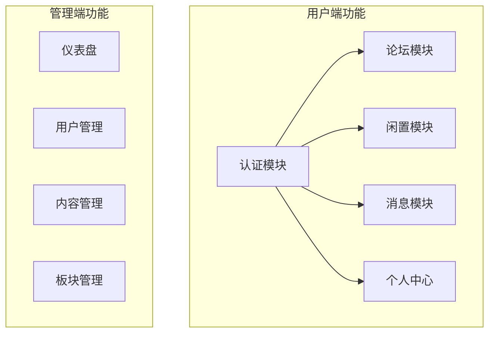
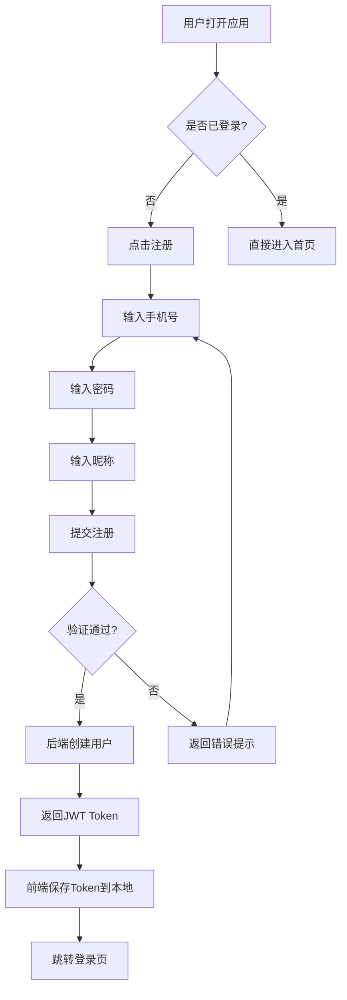
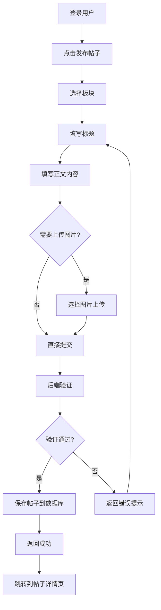
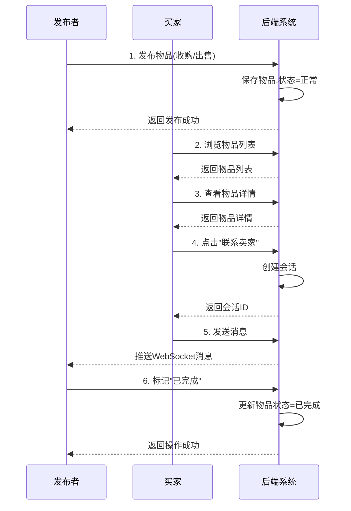
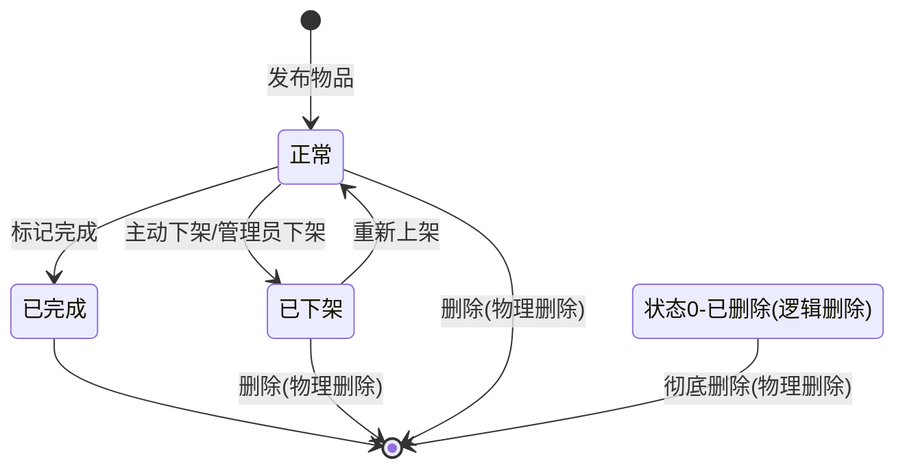
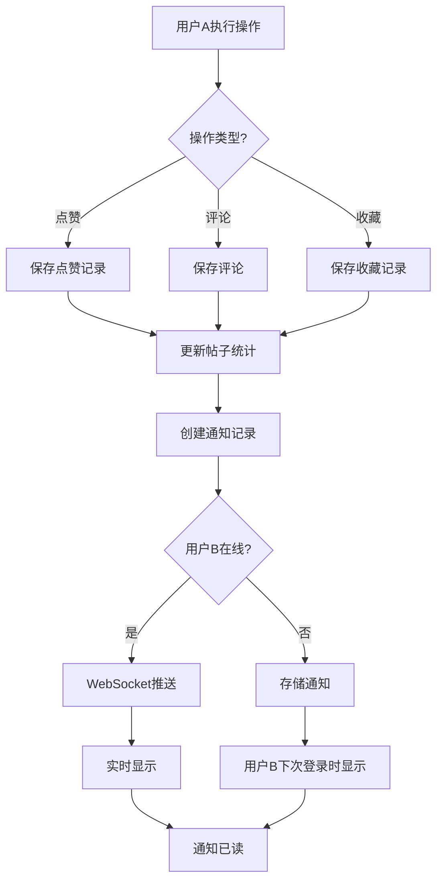
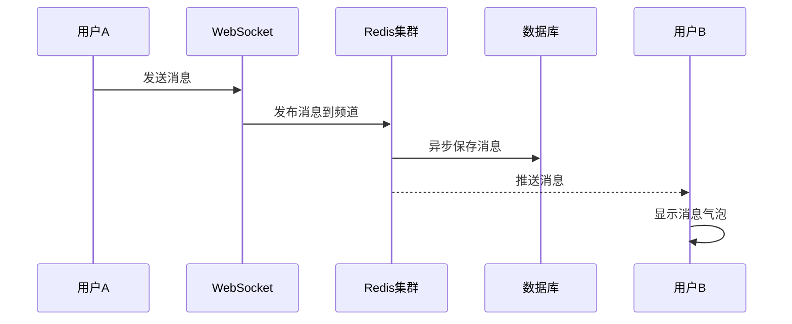
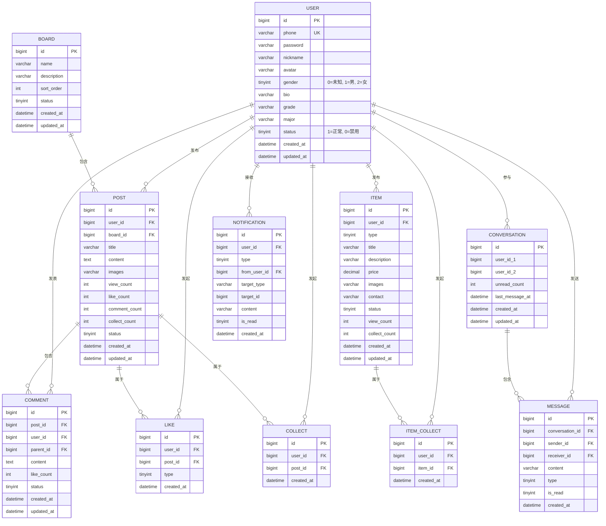

# 校园互助平台 - 产品需求文档 (PRD)

## 文档信息

| 项目 | 内容 |
|------|------|
| 产品名称 | 校园互助平台 |
| 版本号 | 1.0.0 |
| 文档状态 | 正式发布 |
| 最后更新 | 2026-02-25 |
| 密级 | 内部资料 |

---

## 文档修订记录

| 版本 | 日期 | 修订人 | 修订内容 | 审核人 |
|------|------|--------|----------|--------|
| 1.0.0 | 2026-02-25 | 开发者 | 初始版本，完整功能定义 | - |

---

## 1. 产品概述

### 1.1 产品定位

校园互助平台是一个面向大学生群体的综合性校园服务应用，旨在为在校学生提供便捷的交流、交易、通讯平台。

### 1.2 目标用户

| 用户群体 | 特征 |
|----------|------|
| 在校大学生 | 18-25岁，会使用智能手机和电脑 |
| 学校管理者 | 需要管理校园内容、维护平台秩序 |

### 1.3 核心价值

- **交流便利**：提供论坛板块，让学生可以分享经验、交流学习
- **交易安全**：闲置物品交易平台，促成学生间的买卖交易
- **沟通即时**：实时消息系统，支持一对一聊天
- **信息聚合**：集中展示校园动态、通知公告

---

## 2. 功能架构

### 2.1 功能模块总览



### 2.2 用户端功能清单

#### 2.2.1 认证模块

| 功能 | 描述 | 优先级 |
|------|------|--------|
| 用户注册 | 手机号+密码+昵称注册 | P0 |
| 用户登录 | 手机号+密码登录，返回JWT Token | P0 |
| 退出登录 | 清除Token，退出登录状态 | P1 |

#### 2.2.2 论坛模块

| 功能 | 描述 | 优先级 |
|------|------|--------|
| 浏览板块 | 查看论坛板块列表 | P0 |
| 帖子列表 | 分页展示帖子，支持板块筛选 | P0 |
| 帖子详情 | 查看帖子内容和评论 | P0 |
| 发布帖子 | 标题+内容+图片+板块选择 | P0 |
| 删除帖子 | 发布者删除自己的帖子 | P1 |
| 发表评论 | 对帖子进行评论，支持楼中楼 | P0 |
| 删除评论 | 发布者删除自己的评论 | P1 |
| 点赞/取消 | 对帖子点赞或取消点赞 | P0 |
| 收藏/取消 | 收藏帖子或取消收藏 | P1 |
| 查看收藏 | 查看已收藏的帖子列表 | P1 |
| 搜索帖子 | 关键词搜索帖子 | P1 |

#### 2.2.3 闲置交易模块

| 功能 | 描述 | 优先级 |
|------|------|--------|
| 物品列表 | 浏览闲置物品，支持筛选排序 | P0 |
| 物品详情 | 查看物品详细信息 | P0 |
| 发布物品 | 发布收购/出售物品 | P0 |
| 编辑物品 | 修改物品信息 | P1 |
| 删除物品 | 删除物品（物理删除） | P1 |
| 上架物品 | 将下架物品重新上架 | P1 |
| 下架物品 | 将正常物品下架 | P1 |
| 标记完成 | 标记物品为已完成交易 | P1 |
| 收藏物品 | 收藏或取消收藏物品 | P1 |
| 联系卖家 | 点击联系按钮，跳转聊天页面发起对话 | P0 |
| 我的物品 | 查看自己发布的物品 | P1 |
| 我的收藏 | 查看已收藏的物品 | P1 |

**物品类型**：
- 收购：用户求购物品
- 出售：用户出售物品

**物品状态**：
| 状态码 | 说明 |
|--------|------|
| 0 | 已删除 |
| 1 | 正常 |
| 2 | 已完成（已交易） |
| 3 | 已下架 |

#### 2.2.4 消息模块

| 功能 | 描述 | 优先级 |
|------|------|--------|
| 会话列表 | 显示所有聊天会话 | P0 |
| 消息历史 | 查看与某用户的聊天记录 | P0 |
| 发送消息 | 发送文本消息 | P0 |
| 实时接收 | WebSocket实时接收消息 | P0 |
| 标记已读 | 标记会话消息为已读 | P1 |
| 未读数 | 显示未读消息数量 | P0 |
| 系统通知 | 通知列表（评论/点赞/收藏） | P0 |
| 通知已读 | 标记通知为已读 | P1 |

**通知类型**：
| 类型 | 说明 |
|------|------|
| 1 | 评论通知 |
| 2 | 点赞通知 |
| 3 | 收藏通知 |

#### 2.2.5 个人中心

| 功能 | 描述 | 优先级 |
|------|------|--------|
| 我的资料 | 查看个人基本信息 | P0 |
| 编辑资料 | 修改昵称、头像、简介等 | P0 |
| 上传头像 | 上传个人头像图片 | P1 |
| 我的帖子 | 查看自己发布的帖子 | P1 |
| 我的闲置 | 查看自己发布的物品 | P1 |
| 我的收藏 | 查看已收藏的帖子和物品 | P1 |
| 他人主页 | 查看其他用户公开信息 | P1 |

---

## 3. 管理端功能清单

### 3.1 仪表盘

| 功能 | 描述 | 优先级 |
|------|------|--------|
| 数据概览 | 显示用户数、帖子数、物品数等统计 | P0 |
| 数据趋势 | 最近7天/30天数据趋势图 | P1 |

### 3.2 用户管理

| 功能 | 描述 | 优先级 |
|------|------|--------|
| 用户列表 | 查看所有用户 | P0 |
| 用户详情 | 查看用户详细信息 | P1 |
| 禁用用户 | 禁用/启用用户账号 | P1 |
| 封禁用户 | 永久封禁违规用户 | P1 |
| 删除用户 | 删除用户账号 | P2 |

### 3.3 内容管理

| 功能 | 描述 | 优先级 |
|------|------|--------|
| 帖子列表 | 查看所有帖子 | P0 |
| 删除帖子 | 删除违规帖子 | P0 |
| 查看评论 | 查看帖子评论 | P0 |
| 物品列表 | 查看所有物品 | P0 |
| 下架物品 | 下架违规物品 | P0 |
| 删除物品 | 删除违规物品 | P1 |

### 3.4 板块管理

| 功能 | 描述 | 优先级 |
|------|------|--------|
| 板块列表 | 查看所有板块 | P0 |
| 创建板块 | 添加新板块 | P0 |
| 编辑板块 | 修改板块信息 | P1 |
| 删除板块 | 删除板块 | P1 |

### 3.5 存储管理

| 功能 | 描述 | 优先级 |
|------|------|--------|
| 图片列表 | 查看已上传的图片 | P1 |
| 删除图片 | 删除未使用的图片 | P2 |
| 清理图片 | 批量清理未引用图片 | P2 |

---

## 4. 业务流程

### 4.1 用户注册登录流程



**业务规则**：
- 手机号：11位数字，以13/14/15/16/17/18/19开头
- 密码：6-20位字符
- 昵称：2-20位字符
- Token有效期：7天
- 注册成功后跳转登录页，提示用户登录

### 4.2 帖子发布流程



**业务规则**：
- 标题：1-100个字符
- 内容：1-10000个字符
- 图片：最多9张，每张不超过2MB
- 板块：必须选择且板块存在

### 4.3 闲置交易流程



**物品状态流转**：


### 4.4 互动通知流程



**通知类型定义**：
| 类型码 | 通知内容 | 触发动作 |
|--------|----------|----------|
| 1 | "[用户名] 评论了你的帖子" | 他人评论自己的帖子 |
| 2 | "[用户名] 赞了你的帖子" | 他人点赞自己的帖子 |
| 3 | "[用户名] 收藏了你的帖子" | 他人收藏自己的帖子 |

### 4.5 聊天消息流程



**消息存储策略**：
- 实时消息：先通过Redis推送，再异步持久化到MySQL
- 消息历史：从MySQL分页查询
- 未读数：Redis缓存 + MySQL持久化

---

## 5. 数据模型

### 5.1 核心实体

| 实体 | 说明 |
|------|------|
| User | 用户 |
| Post | 帖子 |
| Comment | 评论 |
| Like | 点赞 |
| Collect | 收藏 |
| Board | 板块 |
| Item | 闲置物品 |
| ItemCollect | 物品收藏 |
| Conversation | 聊天会话 |
| Message | 消息 |
| Notification | 通知 |
| Admin | 管理员 |

### 5.2 数据字典

#### 5.2.1 用户表 (user)

| 字段名 | 类型 | 长度 | 主键 | 非空 | 默认值 | 说明 |
|--------|------|------|------|------|--------|------|
| id | bigint | 20 | 是 | 是 | 自增 | 用户ID |
| phone | varchar | 11 | 否 | 是 | - | 手机号(唯一) |
| password | varchar | 100 | 否 | 是 | - | 加密后的密码 |
| nickname | varchar | 20 | 否 | 是 | - | 昵称 |
| avatar | varchar | 500 | 否 | 否 | null | 头像URL |
| gender | tinyint | 1 | 否 | 否 | 0 | 性别: 0未知, 1男, 2女 |
| bio | varchar | 200 | 否 | 否 | null | 个人简介 |
| grade | varchar | 20 | 否 | 否 | null | 年级 |
| major | varchar | 50 | 否 | 否 | null | 专业 |
| status | tinyint | 1 | 否 | 是 | 1 | 状态: 1正常, 0禁用 |
| created_at | datetime | - | 否 | 是 | 当前时间 | 创建时间 |
| updated_at | datetime | - | 否 | 是 | 当前时间 | 更新时间 |

**索引**：
- `idx_phone` (phone) - 用于登录查询
- `idx_status` (status) - 用于状态筛选

#### 5.2.2 帖子表 (post)

| 字段名 | 类型 | 长度 | 主键 | 非空 | 默认值 | 说明 |
|--------|------|------|------|------|--------|------|
| id | bigint | 20 | 是 | 是 | 自增 | 帖子ID |
| user_id | bigint | 20 | 否 | 是 | - | 发布者ID |
| board_id | bigint | 20 | 否 | 是 | - | 板块ID |
| title | varchar | 100 | 否 | 是 | - | 帖子标题 |
| content | text | - | 否 | 是 | - | 帖子正文 |
| images | varchar | 2000 | 否 | 否 | null | 图片URLs(JSON数组) |
| view_count | int | 10 | 否 | 是 | 0 | 浏览次数 |
| like_count | int | 10 | 否 | 是 | 0 | 点赞次数 |
| comment_count | int | 10 | 否 | 是 | 0 | 评论次数 |
| collect_count | int | 10 | 否 | 是 | 0 | 收藏次数 |
| status | tinyint | 1 | 否 | 是 | 1 | 状态: 1正常, 0删除 |
| created_at | datetime | - | 否 | 是 | 当前时间 | 创建时间 |
| updated_at | datetime | - | 否 | 是 | 当前时间 | 更新时间 |

**索引**：
- `idx_user_id` (user_id) - 查询用户帖子
- `idx_board_id` (board_id) - 按板块查询
- `idx_created_at` (created_at) - 时间排序

#### 5.2.3 物品表 (item)

| 字段名 | 类型 | 长度 | 主键 | 非空 | 默认值 | 说明 |
|--------|------|------|------|------|--------|------|
| id | bigint | 20 | 是 | 是 | 自增 | 物品ID |
| user_id | bigint | 20 | 否 | 是 | - | 发布者ID |
| type | tinyint | 1 | 否 | 是 | - | 类型: 1收购, 2出售 |
| title | varchar | 100 | 否 | 是 | - | 物品标题 |
| description | varchar | 1000 | 否 | 是 | - | 物品描述 |
| price | decimal | 10,2 | 否 | 是 | - | 价格(收购时为期望价格) |
| images | varchar | 2000 | 否 | 否 | null | 图片URLs(JSON数组) |
| contact | varchar | 50 | 否 | 否 | null | 联系方式 |
| status | tinyint | 1 | 否 | 是 | 1 | 状态: 1正常, 2已完成, 3下架, 0删除 |
| view_count | int | 10 |否 | 是 | 0 | 浏览次数 |
| collect_count | int | 10 |否 | 是 | 0 | 收藏次数 |
| created_at | datetime | - | 否 | 是 | 当前时间 | 创建时间 |
| updated_at | datetime | - | 否 | 是 | 当前时间 | 更新时间 |

**索引**：
- `idx_user_id` (user_id) - 查询用户物品
- `idx_type` (type) - 按类型筛选
- `idx_status` (status) - 按状态筛选

#### 5.2.4 消息表 (message)

| 字段名 | 类型 | 长度 | 主键 | 非空 | 默认值 | 说明 |
|--------|------|------|------|------|--------|------|
| id | bigint | 20 | 是 | 是 | 自增 | 消息ID |
| conversation_id | bigint | 20 | 否 | 是 | - | 会话ID |
| sender_id | bigint | 20 | 否 | 是 | - | 发送者ID |
| receiver_id | bigint | 20 | 否 | 是 | - | 接收者ID |
| content | varchar | 1000 | 否 | 是 | - | 消息内容 |
| type | tinyint | 1 | 否 | 是 | 1 | 类型: 1文本, 2图片 |
| is_read | tinyint | 1 | 否 | 是 | 0 | 已读状态: 0未读, 1已读 |
| created_at | datetime | - | 否 | 是 | 当前时间 | 创建时间 |

**索引**：
- `idx_conversation_id` (conversation_id) - 查询会话消息
- `idx_receiver_unread` (receiver_id, is_read) - 查询未读消息

#### 5.2.5 通知表 (notification)

| 字段名 | 类型 | 长度 | 主键 | 非空 | 默认值 | 说明 |
|--------|------|------|------|------|--------|------|
| id | bigint | 20 | 是 | 是 | 自增 | 通知ID |
| user_id | bigint | 20 | 否 | 是 | - | 接收者ID |
| type | tinyint | 1 | 否 | 是 | - | 类型: 1评论, 2点赞, 3收藏 |
| from_user_id | bigint | 20 | 否 | 是 | - | 触发者ID |
| target_type | varchar | 20 | 否 | 是 | - | 目标类型: post/item |
| target_id | bigint | 20 | 否 | 是 | - | 目标ID |
| content | varchar | 200 | 否 | 否 | null | 通知内容 |
| is_read | tinyint | 1 | 否 | 是 | 0 | 已读状态: 0未读, 1已读 |
| created_at | datetime | - | 否 | 是 | 当前时间 | 创建时间 |

**索引**：
- `idx_user_unread` (user_id, is_read) - 查询未读通知

#### 5.2.6 板块表 (board)

| 字段名 | 类型 | 长度 | 主键 | 非空 | 默认值 | 说明 |
|--------|------|------|------|------|--------|------|
| id | bigint | 20 | 是 | 是 | 自增 | 板块ID |
| name | varchar | 50 | 否 | 是 | - | 板块名称 |
| description | varchar | 200 | 否 | 否 | null | 板块描述 |
| sort_order | int | 10 | 否 | 是 | 0 | 排序权重 |
| status | tinyint | 1 | 否 | 是 | 1 | 状态: 1正常, 0禁用 |
| created_at | datetime | - | 否 | 是 | 当前时间 | 创建时间 |
| updated_at | datetime | - | 否 | 是 | 当前时间 | 更新时间 |

**索引**：
- `idx_sort_order` (sort_order) - 用于板块排序

#### 5.2.7 评论表 (comment)

| 字段名 | 类型 | 长度 | 主键 | 非空 | 默认值 | 说明 |
|--------|------|------|------|------|--------|------|
| id | bigint | 20 | 是 | 是 | 自增 | 评论ID |
| post_id | bigint | 20 | 否 | 是 | - | 帖子ID |
| user_id | bigint | 20 | 否 | 是 | - | 评论者ID |
| parent_id | bigint | 20 | 否 | 否 | null | 父评论ID(楼中楼) |
| content | text | - | 否 | 是 | - | 评论内容 |
| like_count | int | 10 | 否 | 是 | 0 | 点赞次数 |
| status | tinyint | 1 | 否 | 是 | 1 | 状态: 1正常, 0删除 |
| created_at | datetime | - | 否 | 是 | 当前时间 | 创建时间 |
| updated_at | datetime | - | 否 | 是 | 当前时间 | 更新时间 |

**索引**：
- `idx_post_id` (post_id) - 查询帖子评论
- `idx_user_id` (user_id) - 查询用户评论

#### 5.2.8 点赞表 (like)

| 字段名 | 类型 | 长度 | 主键 | 非空 | 默认值 | 说明 |
|--------|------|------|------|------|--------|------|
| id | bigint | 20 | 是 | 是 | 自增 | 点赞ID |
| user_id | bigint | 20 | 否 | 是 | - | 点赞者ID |
| post_id | bigint | 20 | 否 | 是 | - | 帖子ID |
| type | tinyint | 1 | 否 | 是 | 1 | 类型: 1帖子点赞 |
| created_at | datetime | - | 否 | 是 | 当前时间 | 创建时间 |

**索引**：
- `idx_user_post` (user_id, post_id) - 防止重复点赞

#### 5.2.9 收藏表 (collect)

| 字段名 | 类型 | 长度 | 主键 | 非空 | 默认值 | 说明 |
|--------|------|------|------|------|--------|------|
| id | bigint | 20 | 是 | 是 | 自增 | 收藏ID |
| user_id | bigint | 20 | 否 | 是 | - | 收藏者ID |
| post_id | bigint | 20 | 否 | 是 | - | 帖子ID |
| created_at | datetime | - | 否 | 是 | 当前时间 | 创建时间 |

**索引**：
- `idx_user_post` (user_id, post_id) - 防止重复收藏

#### 5.2.10 物品收藏表 (item_collect)

| 字段名 | 类型 | 长度 | 主键 | 非空 | 默认值 | 说明 |
|--------|------|------|------|------|--------|------|
| id | bigint | 20 | 是 | 是 | 自增 | 收藏ID |
| user_id | bigint | 20 | 否 | 是 | - | 收藏者ID |
| item_id | bigint | 20 | 否 | 是 | - | 物品ID |
| created_at | datetime | - | 否 | 是 | 当前时间 | 创建时间 |

**索引**：
- `idx_user_item` (user_id, item_id) - 防止重复收藏

#### 5.2.11 会话表 (conversation)

| 字段名 | 类型 | 长度 | 主键 | 非空 | 默认值 | 说明 |
|--------|------|------|------|------|--------|------|
| id | bigint | 20 | 是 | 是 | 自增 | 会话ID |
| user_id_1 | bigint | 20 | 否 | 是 | - | 用户1ID |
| user_id_2 | bigint | 20 | 否 | 是 | - | 用户2ID |
| unread_count | int | 10 | 否 | 是 | 0 | 未读消息数 |
| last_message_at | datetime | - | 否 | 是 | 当前时间 | 最后消息时间 |
| created_at | datetime | - | 否 | 是 | 当前时间 | 创建时间 |
| updated_at | datetime | - | 否 | 是 | 当前时间 | 更新时间 |

**索引**：
- `idx_user_pair` (user_id_1, user_id_2) - 查询用户会话
- `uk_user_pair` (user_id_1, user_id_2) - 唯一索引，防止重复会话

### 5.3 实体关系

详见 [BUSINESS_FLOW.md](./BUSINESS_FLOW.md) 中的数据模型关系图

### 5.4 ER图



---

## 6. 非功能需求

### 6.1 性能要求

| 指标 | 目标值 | 测量方法 | 优先级 |
|------|--------|----------|--------|
| 页面首次内容渲染(FCP) | < 1.5秒 | Chrome DevTools | P0 |
| 页面完全加载(LCP) | < 3秒 | Chrome DevTools | P0 |
| API平均响应时间 | < 500ms | APM监控 | P0 |
| API 99分位响应时间 | < 1秒 | APM监控 | P1 |
| 并发支持 | 500+用户同时在线 | 压力测试 | P1 |
| 数据库查询耗时 | < 100ms | 慢查询日志 | P1 |
| WebSocket消息延迟 | < 200ms | 网络监控 | P1 |

**性能测试场景**：
1. 100用户并发登录
2. 200用户同时浏览帖子列表
3. 50用户同时发布帖子
4. 100用户同时聊天
5. 数据库连接池压力测试

### 6.2 可用性要求

| 指标 | 要求 | 说明 |
|------|------|------|
| 系统可用性 | 99.9% | 全年停机时间 < 8.76小时 |
| 故障恢复时间(MTTR) | < 30分钟 | 从故障到恢复 |
| 数据备份频率 | 每日全量 | 凌晨2:00执行 |
| 日志/消息保留周期 | 30天 | 超过30天自动清理（业务数据保留根据业务需求） |
| 核心功能中断 | < 5分钟 | 登录、浏览、聊天 |

### 6.3 安全要求

| 需求 | 要求 | 实现方式 |
|------|------|----------|
| 身份认证 | JWT Token | 7天有效期，Header传递 |
| 密码安全 | BCrypt加密 | 强度因子12 |
| 敏感操作日志 | 完整记录 | 用户ID、操作时间、IP、操作内容 |
| 图片上传限制 | 2MB/张 | 前端+后端双重校验 |
| 接口防护 | SQL注入/XSS | 参数绑定 + HTML转义 |
| CSRF防护 | Token验证 | 请求头携带Token |
| 越权访问 | 资源所属验证 | 修改/删除前验证所有权 |
| 日志审计 | 关键操作记录 | 登录、发布、删除、权限操作 |

**安全测试用例**：
- SQL注入测试：' OR '1'='1
- XSS测试：<script>alert(1)</script>
- 越权测试：修改他人帖子/物品
- 暴力破解：高频登录尝试

### 6.4 兼容性要求

| 平台 | 最低版本 | 测试范围 |
|------|----------|----------|
| iOS Safari | iOS 12+ | 布局、功能、交互 |
| Android Chrome | Android 8+ | 布局、功能、交互 |
| PC Chrome | 最新版-1 | 完整测试 |
| PC Firefox | 最新版-1 | 完整测试 |
| PC Edge | 最新版-1 | 完整测试 |

**响应式断点**：
| 设备类型 | 断点 | 布局 | 导航方式 |
|----------|------|------|----------|
| 移动端 | ≤640px | 全屏宽度 | 底部TabBar |
| 平板 | 768-1023px | 内容居中(最大480px) | 底部TabBar |
| 桌面 | ≥1024px | 内容居中(最大640px) | 左侧边栏 |

### 6.5 监控与运维

| 指标 | 要求 |
|------|------|
| 错误日志收集 | ELK Stack |
| 性能监控 | SkyWalking/Pinpoint |
| 告警阈值 | CPU>80%, 内存>85%, 错误率>1% |
| 日志保留 | 30天 |
| 链路追踪 | 支持 |

---

## 7. UI/UX 设计要求

### 7.1 设计约束

| 约束 | 要求 |
|------|------|
| 配色 | 禁止使用紫色(#6366F1)、橙色 |
| 图标 | 禁止使用图标(Icons) |
| 表情 | 禁止使用emoji |
| 主色调 | #1E3A8A (indigo) |

### 7.2 设计原则

1. **简洁清晰**：界面元素精简，信息层次分明
2. **操作便捷**：常用功能一步直达
3. **视觉统一**：整体风格保持一致
4. **加载友好**：提供加载状态和错误提示

---

## 8. 接口规范

### 8.1 响应格式

```json
{
  "code": 200,
  "message": "操作成功",
  "data": {},
  "timestamp": 1700000000000
}
```

### 8.2 状态码

| 状态码 | 说明 |
|--------|------|
| 200 | 成功 |
| 400 | 请求参数错误 |
| 401 | 未授权（Token无效） |
| 403 | 权限不足 |
| 404 | 资源不存在 |
| 500 | 服务器内部错误 |

### 8.3 认证方式

- Header: `Authorization: Bearer <token>`
- Token有效期: 7天

详见 [BUSINESS_FLOW.md](./BUSINESS_FLOW.md) 中的 API 路由概览

---

## 9. 验收标准

### 9.1 功能验收

#### 9.1.1 认证模块

| 序号 | 测试项 | 验收条件 | 测试方法 |
|------|--------|----------|----------|
| TC-AUTH-01 | 用户注册-正常 | 输入合法手机号、密码、昵称，注册成功并跳转登录页 | 手动测试 |
| TC-AUTH-02 | 用户注册-手机号格式错误 | 输入非11位手机号，提示"手机号格式错误" | 边界测试 |
| TC-AUTH-03 | 用户注册-密码长度不足 | 输入少于6位密码，提示"密码长度不足" | 边界测试 |
| TC-AUTH-04 | 用户注册-昵称为空 | 不输入昵称，提示"昵称不能为空" | 边界测试 |
| TC-AUTH-05 | 用户注册-手机号重复 | 使用已注册手机号，提示"手机号已注册" | 异常测试 |
| TC-AUTH-06 | 用户登录-正常 | 输入正确手机号密码，登录成功并跳转首页 | 手动测试 |
| TC-AUTH-07 | 用户登录-密码错误 | 输入错误密码，提示"密码错误" | 异常测试 |
| TC-AUTH-08 | 用户登录-账号不存在 | 输入未注册手机号，提示"用户不存在" | 异常测试 |
| TC-AUTH-09 | 退出登录 | 点击退出，Token清除，跳转登录页 | 手动测试 |
| TC-AUTH-10 | Token过期 | Token过期后请求，提示401，跳转登录页 | 异常测试 |

#### 9.1.2 论坛模块

| 序号 | 测试项 | 验收条件 | 测试方法 |
|------|--------|----------|----------|
| TC-FORUM-01 | 浏览板块 | 进入首页，显示所有板块列表 | 手动测试 |
| TC-FORUM-02 | 帖子列表-默认排序 | 按最新发布时间倒序展示 | 手动测试 |
| TC-FORUM-03 | 帖子列表-板块筛选 | 选择板块，仅显示该板块帖子 | 手动测试 |
| TC-FORUM-04 | 帖子列表-分页 | 每页10条，超过自动分页 | 手动测试 |
| TC-FORUM-05 | 帖子详情 | 显示标题、内容、图片、统计信息 | 手动测试 |
| TC-FORUM-06 | 发布帖子-正常 | 输入标题+内容，选择板块，发布成功 | 手动测试 |
| TC-FORUM-07 | 发布帖子-标题为空 | 不输入标题，提示"标题不能为空" | 边界测试 |
| TC-FORUM-08 | 发布帖子-内容为空 | 不输入内容，提示"内容不能为空" | 边界测试 |
| TC-FORUM-09 | 发布帖子-未选择板块 | 不选择板块，提示"请选择板块" | 边界测试 |
| TC-FORUM-10 | 发布帖子-图片上传 | 上传图片成功，图片显示在正文中 | 手动测试 |
| TC-FORUM-11 | 发布帖子-图片超限 | 上传超过9张，提示"最多上传9张图片" | 边界测试 |
| TC-FORUM-12 | 发布帖子-图片过大 | 上传超过2MB图片，提示"图片大小不能超过2MB" | 边界测试 |
| TC-FORUM-13 | 发表评论 | 输入评论内容，提交成功，评论显示 | 手动测试 |
| TC-FORUM-14 | 回复评论 | 对评论进行回复，显示楼中楼 | 手动测试 |
| TC-FORUM-15 | 删除自己评论 | 点击删除，评论被删除 | 手动测试 |
| TC-FORUM-16 | 删除他人评论 | 无删除按钮，提示无权限 | 异常测试 |
| TC-FORUM-17 | 点赞帖子 | 点击点赞，点赞数+1，显示已点赞 | 手动测试 |
| TC-FORUM-18 | 取消点赞 | 再次点击点赞，取消点赞，点赞数-1 | 手动测试 |
| TC-FORUM-19 | 重复点赞 | 点赞后刷新，状态保持，不重复计数 | 异常测试 |
| TC-FORUM-20 | 收藏帖子 | 点击收藏，收藏成功，显示已收藏 | 手动测试 |
| TC-FORUM-21 | 取消收藏 | 再次点击收藏，取消收藏 | 手动测试 |
| TC-FORUM-22 | 查看收藏列表 | 进入收藏列表，显示所有收藏帖子 | 手动测试 |
| TC-FORUM-23 | 搜索帖子 | 输入关键词，显示匹配帖子 | 手动测试 |
| TC-FORUM-24 | 删除自己帖子 | 点击删除，帖子被删除 | 手动测试 |
| TC-FORUM-25 | 删除他人帖子 | 无删除按钮，提示无权限 | 异常测试 |

#### 9.1.3 闲置交易模块

| 序号 | 测试项 | 验收条件 | 测试方法 |
|------|--------|----------|----------|
| TC-TRADE-01 | 物品列表-正常 | 显示所有在售物品列表 | 手动测试 |
| TC-TRADE-02 | 物品列表-类型筛选 | 选择收购/出售，仅显示对应类型 | 手动测试 |
| TC-TRADE-03 | 物品列表-状态筛选 | 筛选正常/已完成/下架物品 | 手动测试 |
| TC-TRADE-04 | 物品列表-排序 | 按最新/价格/浏览量排序 | 手动测试 |
| TC-TRADE-05 | 物品详情 | 显示物品标题、描述、价格、图片 | 手动测试 |
| TC-TRADE-06 | 发布物品-出售 | 选择出售类型，填写信息，发布成功 | 手动测试 |
| TC-TRADE-07 | 发布物品-收购 | 选择收购类型，填写期望价格，发布成功 | 手动测试 |
| TC-TRADE-08 | 发布物品-必填项为空 | 必填项为空，提示相应错误 | 边界测试 |
| TC-TRADE-09 | 联系卖家 | 点击联系，跳转聊天页面 | 手动测试 |
| TC-TRADE-10 | 标记完成 | 物品状态变为已完成，不再显示在列表 | 手动测试 |
| TC-TRADE-11 | 下架物品 | 物品状态变为下架，仅自己可见 | 手动测试 |
| TC-TRADE-12 | 上架物品 | 下架物品可重新上架为正常 | 手动测试 |
| TC-TRADE-13 | 删除物品 | 物品被物理删除，列表不显示 | 手动测试 |
| TC-TRADE-14 | 收藏物品 | 收藏物品成功，列表显示 | 手动测试 |
| TC-TRADE-15 | 查看我的物品 | 仅显示自己发布的物品 | 手动测试 |

#### 9.1.4 消息模块

| 序号 | 测试项 | 验收条件 | 测试方法 |
|------|--------|----------|----------|
| TC-MSG-01 | 会话列表 | 显示所有聊天会话，最新消息在上 | 手动测试 |
| TC-MSG-02 | 发送消息 | 发送文本，接收方实时收到 | 手动测试 |
| TC-MSG-03 | 接收消息-在线 | WebSocket推送，实时显示 | 手动测试 |
| TC-MSG-04 | 接收消息-离线 | 登录后拉取离线消息 | 手动测试 |
| TC-MSG-05 | 未读数显示 | 会话未读数正确显示 | 手动测试 |
| TC-MSG-06 | 标记已读 | 进入会话，未读数清零 | 手动测试 |
| TC-MSG-07 | 通知列表 | 显示所有系统通知 | 手动测试 |
| TC-MSG-08 | 通知已读 | 点击通知，标记为已读 | 手动测试 |

#### 9.1.5 个人中心

| 序号 | 测试项 | 验收条件 | 测试方法 |
|------|--------|----------|----------|
| TC-PROFILE-01 | 查看个人资料 | 显示昵称、头像、简介等信息 | 手动测试 |
| TC-PROFILE-02 | 编辑资料 | 修改信息成功，保存后生效 | 手动测试 |
| TC-PROFILE-03 | 上传头像 | 选择图片，头像更新成功 | 手动测试 |
| TC-PROFILE-04 | 上传头像-文件过大 | 超过2MB，提示错误 | 边界测试 |
| TC-PROFILE-05 | 我的帖子 | 显示自己发布的所有帖子 | 手动测试 |
| TC-PROFILE-06 | 我的闲置 | 显示自己发布的所有物品 | 手动测试 |
| TC-PROFILE-07 | 我的收藏 | 显示所有收藏的帖子和物品 | 手动测试 |
| TC-PROFILE-08 | 他人主页 | 查看他人公开信息 | 手动测试 |

#### 9.1.6 管理端

| 序号 | 测试项 | 验收条件 | 测试方法 |
|------|--------|----------|----------|
| TC-ADMIN-01 | 仪表盘统计 | 显示用户数、帖子数、物品数 | 手动测试 |
| TC-ADMIN-02 | 用户列表 | 分页显示所有用户 | 手动测试 |
| TC-ADMIN-03 | 禁用用户 | 禁用后用户无法登录 | 手动测试 |
| TC-ADMIN-04 | 启用用户 | 禁用用户可重新启用 | 手动测试 |
| TC-ADMIN-05 | 帖子列表 | 显示所有帖子，可搜索 | 手动测试 |
| TC-ADMIN-06 | 删除帖子 | 删除帖子成功，列表不显示 | 手动测试 |
| TC-ADMIN-07 | 物品列表 | 显示所有物品，可筛选状态 | 手动测试 |
| TC-ADMIN-08 | 下架物品 | 物品状态变为下架 | 手动测试 |
| TC-ADMIN-09 | 板块列表 | 显示所有板块 | 手动测试 |
| TC-ADMIN-10 | 创建板块 | 新建板块成功，列表显示 | 手动测试 |
| TC-ADMIN-11 | 编辑板块 | 修改板块信息成功 | 手动测试 |
| TC-ADMIN-12 | 删除板块 | 删除板块，帖子需重新分配 | 手动测试 |
| TC-ADMIN-13 | 图片管理 | 显示所有上传图片 | 手动测试 |
| TC-ADMIN-14 | 清理未使用图片 | 删除未引用图片成功 | 手动测试 |

### 9.2 性能验收

| 指标 | 验收条件 | 测试工具 |
|------|----------|----------|
| 首页加载时间 | FCP < 1.5s, LCP < 3s | Chrome DevTools |
| API平均响应时间 | < 500ms | Postman/JMeter |
| API 99分位时间 | < 1s | APM工具 |
| 聊天消息延迟 | < 200ms | 网络监控 |
| 并发登录(100用户) | 成功率 > 99% | JMeter |
| 并发发帖(50用户) | 成功率 > 99% | JMeter |
| 数据库连接 | < 50ms | MySQL监控 |

### 9.3 安全验收

| 序号 | 测试项 | 验收条件 |
|------|--------|----------|
| TC-SEC-01 | SQL注入防护 | 输入 ' OR '1'='1，无数据泄露 |
| TC-SEC-02 | XSS防护 | 输入 <script>alert(1)</script>，脚本不执行 |
| TC-SEC-03 | 越权访问 | 修改他人帖子/物品，返回403 |
| TC-SEC-04 | Token过期 | 过期后请求，返回401 |
| TC-SEC-05 | 密码加密 | 数据库存储为加密值，非明文 |
| TC-SEC-06 | 文件上传限制 | 上传非图片文件，提示错误 |

### 9.4 兼容性验收

| 平台 | 验收条件 |
|------|----------|
| iOS Safari (iOS 12+) | 布局正常，功能可用 |
| Android Chrome (Android 8+) | 布局正常，功能可用 |
| PC Chrome | 完整功能测试通过 |
| PC Firefox | 完整功能测试通过 |
| PC Edge | 完整功能测试通过 |

### 9.5 验收checklist

```
□ 所有P0功能测试通过
□ 所有P1功能测试通过
□ 性能指标达到要求
□ 安全测试通过
□ 兼容性问题修复完成
□ 缺陷全部关闭或遗留
□ 文档齐全
□ 上线审批通过
```

---

## 10. 术语表

| 术语 | 说明 |
|------|------|
| JWT | JSON Web Token，用于用户认证 |
| WebSocket | 实时通信协议 |
| 读写分离 | 数据库一主多从架构 |
| Redis | 缓存和消息队列 |
| CRUD | Create/Read/Update/Delete |
| FCP | First Contentful Paint，首次内容绘制 |
| LCP | Largest Contentful Paint，最大内容绘制 |
| MTTR | Mean Time To Recovery，平均恢复时间 |
| APM | Application Performance Monitoring，应用性能监控 |

---

## 11. 风险评估

### 11.1 技术风险

| 风险项 | 影响程度 | 应对措施 |
|--------|----------|----------|
| WebSocket高并发 | 中 | 做好水平扩展准备 |
| 图片存储 | 低 | 使用云存储OSS |
| 数据库性能 | 中 | 添加读写分离 |
| 安全漏洞 | 高 | 定期安全审计 |

### 11.2 项目风险

| 风险项 | 影响程度 | 应对措施 |
|--------|----------|----------|
| 需求变更 | 中 | 预留缓冲时间 |
| 进度延迟 | 中 | 每日站会跟进 |
| 测试不充分 | 高 | 增加测试轮次 |

### 11.3 业务风险

| 风险项 | 影响程度 | 应对措施 |
|--------|----------|----------|
| 用户并发超预期 | 低 | 弹性扩容 |
| 恶意用户 | 中 | 完善风控规则 |
| 数据丢失 | 高 | 定期备份 + 异地容灾 |

---

## 12. 参考文档

- [ARCHITECTURE.md](./ARCHITECTURE.md) - 系统架构设计
- [BUSINESS_FLOW.md](./BUSINESS_FLOW.md) - 业务流程
- [QUICK_START.md](./QUICK_START.md) - 快速启动
- [DEPLOYMENT_PROD.md](./DEPLOYMENT_PROD.md) - 生产部署

---

## 附录

### 附录A：测试账号

| 角色 | 用户名 | 密码 | 说明 |
|------|--------|------|------|
| 管理员 | admin | admin123 | 超级管理员，拥有所有权限 |
| 测试用户 | 13800000001 | 123456 | 普通用户，用于功能测试 |

### 附录B：接口基础信息

| 环境 | 地址 |
|------|------|
| 开发环境 | http://localhost:8080/api |
| 用户端 | http://localhost:3000 |
| 管理端 | http://localhost:3001 |
| Swagger文档 | http://localhost:8080/swagger-ui.html |

### 附录C：第三方依赖

| 组件 | 版本 | 用途 |
|------|------|------|
| Spring Boot | 3.2.0 | 后端框架 |
| Vue 3 | 3.4.0 | 前端框架 |
| MyBatis-Plus | 3.5.5 | ORM框架 |
| JWT | 0.12.3 | 身份认证 |
| Redis | 7.x | 缓存/消息队列 |
| MySQL | 8.0 | 数据库 |
